# LPU SMART NAVIGATOR / LPU PATHFINDER

**A PROJECT REPORT**

*Submitted in partial fulfillment of the requirements for the award of the degree of*

**BACHELOR OF TECHNOLOGY**  
**in**  
**COMPUTER SCIENCE AND ENGINEERING**

---

### Submitted By:
**Dipti Mishra**  
Registration Number: **12410476**

---

**DEPARTMENT OF COMPUTER SCIENCE AND ENGINEERING**  
**LOVELY PROFESSIONAL UNIVERSITY**  
**PHAGWARA, PUNJAB**  

---

<br/>

## DECLARATION

I, **Dipti Mishra** (Registration Number: **12410476**), student of the Department of Computer Science and Engineering, Lovely Professional University, Phagwara, Punjab, hereby declare that the project report entitled **"LPU Smart Navigator / LPU Pathfinder"** is an authentic record of my original work carried out within the Department of Computer Science and Engineering at Lovely Professional University.

I further declare that the content embodied in this project report has not been submitted, in full or in part, for the award of any other degree, diploma, or title at this or any other university or institution. All assistance, external references, source materials, and software tools utilized during the execution of this work have been duly acknowledged.

<br/>

**Dipti Mishra**  
Registration Number: **12410476**  
Department of Computer Science and Engineering  
Lovely Professional University, Phagwara, Punjab  

---

<br/>

## TRAINING / PROJECT CERTIFICATE

`[OFFICIAL CERTIFICATE TO BE INSERTED HERE IF REQUIRED]`

---

<br/>

## ACKNOWLEDGEMENT

I express my sincere gratitude to **Lovely Professional University**, Phagwara, Punjab, and the **Department of Computer Science and Engineering** for providing the academic facilities, laboratory environment, and computing infrastructure necessary to execute this project work.

I am appreciative of the institutional support and technical feedback provided during academic evaluations by the Department of Computer Science and Engineering. The foundation derived from coursework, algorithmic literature, and software design standards proved fundamental to the successful implementation of this system.

Finally, I express my gratitude to my family and peers for their constant support, encouragement, and patience during the design, implementation, and benchmarking of this work.

<br/>

**Dipti Mishra**  
Registration Number: **12410476**  

---

<br/>

## LIST OF TABLES

| Table Number | Title / Description | Page Reference |
| :--- | :--- | :--- |
| **Table 1.1** | Project Implementation Work Plan | `[PAGE NUMBER TO BE GENERATED IN FINAL DOCUMENT]` |
| **Table 2.1** | Functional Requirements | `[PAGE NUMBER TO BE GENERATED IN FINAL DOCUMENT]` |
| **Table 2.2** | Non-Functional Requirements | `[PAGE NUMBER TO BE GENERATED IN FINAL DOCUMENT]` |
| **Table 2.3** | Technology Stack Specification | `[PAGE NUMBER TO BE GENERATED IN FINAL DOCUMENT]` |
| **Table 2.4** | Comparative Analysis: Existing Methods vs Proposed System | `[PAGE NUMBER TO BE GENERATED IN FINAL DOCUMENT]` |
| **Table 3.1** | Graph Dataset Statistics | `[PAGE NUMBER TO BE GENERATED IN FINAL DOCUMENT]` |
| **Table 3.2** | Algorithmic Comparison: A* Search vs. Dijkstra's Algorithm | `[PAGE NUMBER TO BE GENERATED IN FINAL DOCUMENT]` |
| **Table 3.3** | Backend API Endpoints Specification | `[PAGE NUMBER TO BE GENERATED IN FINAL DOCUMENT]` |
| **Table 3.4** | Important Backend and Frontend Source Modules | `[PAGE NUMBER TO BE GENERATED IN FINAL DOCUMENT]` |
| **Table 4.1** | Functional Test Cases | `[PAGE NUMBER TO BE GENERATED IN FINAL DOCUMENT]` |
| **Table 4.2** | Routing Performance Benchmark Results | `[PAGE NUMBER TO BE GENERATED IN FINAL DOCUMENT]` |
| **Table 5.1** | Achievement of Project Objectives | `[PAGE NUMBER TO BE GENERATED IN FINAL DOCUMENT]` |
| **Table C.1** | Extended Edge Case & Boundary Verification Test Matrix | `[PAGE NUMBER TO BE GENERATED IN FINAL DOCUMENT]` |
| **Table D.1** | Comprehensive File Registry and Module Mapping | `[PAGE NUMBER TO BE GENERATED IN FINAL DOCUMENT]` |

---

<br/>

## LIST OF FIGURES / CHARTS

| Figure Number | Title / Description | Page Reference |
| :--- | :--- | :--- |
| **Figure 1.1** | High-Level Project Workflow Pipeline | `[PAGE NUMBER TO BE GENERATED IN FINAL DOCUMENT]` |
| **Figure 2.1** | System Architecture Diagram | `[PAGE NUMBER TO BE GENERATED IN FINAL DOCUMENT]` |
| **Figure 2.2** | Use Case Diagram | `[PAGE NUMBER TO BE GENERATED IN FINAL DOCUMENT]` |
| **Figure 2.3** | End-to-End Application Flow Diagram | `[PAGE NUMBER TO BE GENERATED IN FINAL DOCUMENT]` |
| **Figure 3.1** | Frontend Component Structure | `[PAGE NUMBER TO BE GENERATED IN FINAL DOCUMENT]` |
| **Figure 3.2** | POI Search and Location Selection Interface | `[PAGE NUMBER TO BE GENERATED IN FINAL DOCUMENT]` |
| **Figure 3.3** | Frontend Route Request and Response Flow | `[PAGE NUMBER TO BE GENERATED IN FINAL DOCUMENT]` |
| **Figure 3.4** | Frontend Data Flow Diagram | `[PAGE NUMBER TO BE GENERATED IN FINAL DOCUMENT]` |
| **Figure 3.5** | Main Navigation Interface Browser Screenshot | `[PAGE NUMBER TO BE GENERATED IN FINAL DOCUMENT]` |
| **Figure 3.6** | POI Search and Selection Browser Screenshot | `[PAGE NUMBER TO BE GENERATED IN FINAL DOCUMENT]` |
| **Figure 3.7** | Calculated Route Display Browser Screenshot | `[PAGE NUMBER TO BE GENERATED IN FINAL DOCUMENT]` |
| **Figure 3.8** | Backend Module Architecture | `[PAGE NUMBER TO BE GENERATED IN FINAL DOCUMENT]` |
| **Figure 3.9** | A* Routing Workflow | `[PAGE NUMBER TO BE GENERATED IN FINAL DOCUMENT]` |
| **Figure 3.10** | Administrative Graph Editing Workflow | `[PAGE NUMBER TO BE GENERATED IN FINAL DOCUMENT]` |
| **Figure 4.1** | Routing Algorithm Performance Benchmark Comparison | `[PAGE NUMBER TO BE GENERATED IN FINAL DOCUMENT]` |

---

<br/>

## LIST OF ABBREVIATIONS

| Abbreviation | Full Expansion |
| :--- | :--- |
| **API** | Application Programming Interface |
| **A\*** | A-Star Search Algorithm |
| **BFS** | Breadth-First Search Algorithm |
| **CORS** | Cross-Origin Resource Sharing |
| **CPP / C++** | C++ Programming Language (C++20 Standard) |
| **CSS** | Cascading Style Sheets |
| **DOM** | Document Object Model |
| **GIS** | Geographic Information System |
| **GPS** | Global Positioning System |
| **HTTP** | Hypertext Transfer Protocol |
| **JSON** | JavaScript Object Notation |
| **JWT** | JSON Web Token |
| **LPU** | Lovely Professional University |
| **OSM** | OpenStreetMap |
| **POI** | Point of Interest |
| **POSIX** | Portable Operating System Interface |
| **REST** | Representational State Transfer |
| **SRS** | Software Requirements Specification |
| **TCP / IP** | Transmission Control Protocol / Internet Protocol |
| **TS / TSX** | TypeScript / TypeScript JSX |
| **UI / UX** | User Interface / User Experience |
| **WGS84** | World Geodetic System 1984 |

---

<br/>

## TABLE OF CONTENTS

- **FRONT MATTER**
  - Cover Page `[PAGE NUMBER TO BE GENERATED IN FINAL DOCUMENT]`
  - Declaration `[PAGE NUMBER TO BE GENERATED IN FINAL DOCUMENT]`
  - Training / Project Certificate `[PAGE NUMBER TO BE GENERATED IN FINAL DOCUMENT]`
  - Acknowledgement `[PAGE NUMBER TO BE GENERATED IN FINAL DOCUMENT]`
  - List of Tables `[PAGE NUMBER TO BE GENERATED IN FINAL DOCUMENT]`
  - List of Figures / Charts `[PAGE NUMBER TO BE GENERATED IN FINAL DOCUMENT]`
  - List of Abbreviations `[PAGE NUMBER TO BE GENERATED IN FINAL DOCUMENT]`
  - Table of Contents `[PAGE NUMBER TO BE GENERATED IN FINAL DOCUMENT]`

- **CHAPTER 1: INTRODUCTION OF THE PROJECT UNDERTAKEN**
  - 1.1 Background `[PAGE NUMBER TO BE GENERATED IN FINAL DOCUMENT]`
  - 1.2 Problem Statement `[PAGE NUMBER TO BE GENERATED IN FINAL DOCUMENT]`
  - 1.3 Motivation `[PAGE NUMBER TO BE GENERATED IN FINAL DOCUMENT]`
  - 1.4 Objectives of the Work Undertaken `[PAGE NUMBER TO BE GENERATED IN FINAL DOCUMENT]`
  - 1.5 Scope of the Work `[PAGE NUMBER TO BE GENERATED IN FINAL DOCUMENT]`
  - 1.6 Importance and Applicability `[PAGE NUMBER TO BE GENERATED IN FINAL DOCUMENT]`
  - 1.7 Relevance of the Project `[PAGE NUMBER TO BE GENERATED IN FINAL DOCUMENT]`
  - 1.8 Existing System `[PAGE NUMBER TO BE GENERATED IN FINAL DOCUMENT]`
  - 1.9 Proposed System `[PAGE NUMBER TO BE GENERATED IN FINAL DOCUMENT]`
  - 1.10 Advantages of the Proposed System `[PAGE NUMBER TO BE GENERATED IN FINAL DOCUMENT]`
  - 1.11 Work Plan `[PAGE NUMBER TO BE GENERATED IN FINAL DOCUMENT]`
  - 1.12 Chapter Summary `[PAGE NUMBER TO BE GENERATED IN FINAL DOCUMENT]`

- **CHAPTER 2: SYSTEM ANALYSIS AND REQUIREMENTS**
  - 2.1 Requirement Analysis `[PAGE NUMBER TO BE GENERATED IN FINAL DOCUMENT]`
  - 2.2 Stakeholders and Intended Users `[PAGE NUMBER TO BE GENERATED IN FINAL DOCUMENT]`
  - 2.3 Functional Requirements `[PAGE NUMBER TO BE GENERATED IN FINAL DOCUMENT]`
  - 2.4 Non-Functional Requirements `[PAGE NUMBER TO BE GENERATED IN FINAL DOCUMENT]`
  - 2.5 Hardware Requirements `[PAGE NUMBER TO BE GENERATED IN FINAL DOCUMENT]`
  - 2.6 Software Requirements `[PAGE NUMBER TO BE GENERATED IN FINAL DOCUMENT]`
  - 2.7 Technology Stack `[PAGE NUMBER TO BE GENERATED IN FINAL DOCUMENT]`
  - 2.8 Feasibility Analysis `[PAGE NUMBER TO BE GENERATED IN FINAL DOCUMENT]`
  - 2.9 Existing System vs Proposed System `[PAGE NUMBER TO BE GENERATED IN FINAL DOCUMENT]`
  - 2.10 System Architecture `[PAGE NUMBER TO BE GENERATED IN FINAL DOCUMENT]`
  - 2.11 Use Case Analysis `[PAGE NUMBER TO BE GENERATED IN FINAL DOCUMENT]`
  - 2.12 Use Case Diagram `[PAGE NUMBER TO BE GENERATED IN FINAL DOCUMENT]`
  - 2.13 Application / System Flow `[PAGE NUMBER TO BE GENERATED IN FINAL DOCUMENT]`
  - 2.14 Chapter Summary `[PAGE NUMBER TO BE GENERATED IN FINAL DOCUMENT]`

- **CHAPTER 3: SYSTEM DESIGN AND IMPLEMENTATION**
  - **PART 3 — FRONTEND, UI AND USER INTERACTION**
    - 3.1 System Design Overview `[PAGE NUMBER TO BE GENERATED IN FINAL DOCUMENT]`
    - 3.2 Frontend Architecture `[PAGE NUMBER TO BE GENERATED IN FINAL DOCUMENT]`
    - 3.3 Component Tree & Structure `[PAGE NUMBER TO BE GENERATED IN FINAL DOCUMENT]`
    - 3.4 Main View Interface `[PAGE NUMBER TO BE GENERATED IN FINAL DOCUMENT]`
    - 3.5 Navigation Panel Overlay `[PAGE NUMBER TO BE GENERATED IN FINAL DOCUMENT]`
    - 3.6 POI Search & Selection Interface `[PAGE NUMBER TO BE GENERATED IN FINAL DOCUMENT]`
    - 3.7 Leaflet Map Layer Integration `[PAGE NUMBER TO BE GENERATED IN FINAL DOCUMENT]`
    - 3.8 OpenStreetMap Tile Layer Configuration `[PAGE NUMBER TO BE GENERATED IN FINAL DOCUMENT]`
    - 3.9 POI Marker Rendering & Popups `[PAGE NUMBER TO BE GENERATED IN FINAL DOCUMENT]`
    - 3.10 Route Polyline Layer Rendering `[PAGE NUMBER TO BE GENERATED IN FINAL DOCUMENT]`
    - 3.11 User Flow: Location Selection to Route Display `[PAGE NUMBER TO BE GENERATED IN FINAL DOCUMENT]`
    - 3.12 Navigation Control Handlers `[PAGE NUMBER TO BE GENERATED IN FINAL DOCUMENT]`
    - 3.13 API Communication Module `[PAGE NUMBER TO BE GENERATED IN FINAL DOCUMENT]`
    - 3.14 Application Screenshots `[PAGE NUMBER TO BE GENERATED IN FINAL DOCUMENT]`
    - 3.15 Interface Usability Features `[PAGE NUMBER TO BE GENERATED IN FINAL DOCUMENT]`
    - 3.16 Client-Side Data Management `[PAGE NUMBER TO BE GENERATED IN FINAL DOCUMENT]`
  - **PART 4 — BACKEND, GRAPH ENGINE, ROUTING ALGORITHMS, APIs AND ADMINISTRATION**
    - 3.17 Backend Architecture `[PAGE NUMBER TO BE GENERATED IN FINAL DOCUMENT]`
    - 3.18 C++20 Backend Implementation `[PAGE NUMBER TO BE GENERATED IN FINAL DOCUMENT]`
    - 3.19 CMake Build Configuration `[PAGE NUMBER TO BE GENERATED IN FINAL DOCUMENT]`
    - 3.20 Native POSIX Socket HTTP Server `[PAGE NUMBER TO BE GENERATED IN FINAL DOCUMENT]`
    - 3.21 Graph Representation `[PAGE NUMBER TO BE GENERATED IN FINAL DOCUMENT]`
    - 3.22 Node Data Structure `[PAGE NUMBER TO BE GENERATED IN FINAL DOCUMENT]`
    - 3.23 Edge Data Structure `[PAGE NUMBER TO BE GENERATED IN FINAL DOCUMENT]`
    - 3.24 Graph Construction and Adjacency `[PAGE NUMBER TO BE GENERATED IN FINAL DOCUMENT]`
    - 3.25 A* Search Algorithm `[PAGE NUMBER TO BE GENERATED IN FINAL DOCUMENT]`
    - 3.26 Haversine Heuristic `[PAGE NUMBER TO BE GENERATED IN FINAL DOCUMENT]`
    - 3.27 Dijkstra Algorithm `[PAGE NUMBER TO BE GENERATED IN FINAL DOCUMENT]`
    - 3.28 A* vs Dijkstra Comparison `[PAGE NUMBER TO BE GENERATED IN FINAL DOCUMENT]`
    - 3.29 Route Reconstruction `[PAGE NUMBER TO BE GENERATED IN FINAL DOCUMENT]`
    - 3.30 Polyline Geometry Construction `[PAGE NUMBER TO BE GENERATED IN FINAL DOCUMENT]`
    - 3.31 API Endpoints Specification `[PAGE NUMBER TO BE GENERATED IN FINAL DOCUMENT]`
    - 3.32 JSON Persistence `[PAGE NUMBER TO BE GENERATED IN FINAL DOCUMENT]`
    - 3.33 LocalStorage Usage `[PAGE NUMBER TO BE GENERATED IN FINAL DOCUMENT]`
    - 3.34 Client-Side Routing Fallback — Technical Detail `[PAGE NUMBER TO BE GENERATED IN FINAL DOCUMENT]`
    - 3.35 Admin Authentication `[PAGE NUMBER TO BE GENERATED IN FINAL DOCUMENT]`
    - 3.36 Admin Graph Editor Implementation `[PAGE NUMBER TO BE GENERATED IN FINAL DOCUMENT]`
    - 3.37 Snap-to-Edge Logic `[PAGE NUMBER TO BE GENERATED IN FINAL DOCUMENT]`
    - 3.38 Graph Validation Engine `[PAGE NUMBER TO BE GENERATED IN FINAL DOCUMENT]`
    - 3.39 Save and Hot Reload Workflow `[PAGE NUMBER TO BE GENERATED IN FINAL DOCUMENT]`
    - 3.40 Important Source Modules Summary `[PAGE NUMBER TO BE GENERATED IN FINAL DOCUMENT]`
    - 3.41 Design Decisions and Trade-offs `[PAGE NUMBER TO BE GENERATED IN FINAL DOCUMENT]`
    - 3.42 Chapter Summary `[PAGE NUMBER TO BE GENERATED IN FINAL DOCUMENT]`

- **CHAPTER 4: TESTING, RESULTS AND EVALUATION**
  - 4.1 Testing Strategy `[PAGE NUMBER TO BE GENERATED IN FINAL DOCUMENT]`
  - 4.2 Backend Build Verification `[PAGE NUMBER TO BE GENERATED IN FINAL DOCUMENT]`
  - 4.3 Frontend Verification `[PAGE NUMBER TO BE GENERATED IN FINAL DOCUMENT]`
  - 4.4 Backend Runtime Verification `[PAGE NUMBER TO BE GENERATED IN FINAL DOCUMENT]`
  - 4.5 API Testing `[PAGE NUMBER TO BE GENERATED IN FINAL DOCUMENT]`
  - 4.6 Functional Testing `[PAGE NUMBER TO BE GENERATED IN FINAL DOCUMENT]`
  - 4.7 UI Testing `[PAGE NUMBER TO BE GENERATED IN FINAL DOCUMENT]`
  - 4.8 Admin Editor Verification `[PAGE NUMBER TO BE GENERATED IN FINAL DOCUMENT]`
  - 4.9 Dataset Validation Analysis `[PAGE NUMBER TO BE GENERATED IN FINAL DOCUMENT]`
  - 4.10 A* and Dijkstra Verification `[PAGE NUMBER TO BE GENERATED IN FINAL DOCUMENT]`
  - 4.11 Performance Benchmark Analysis `[PAGE NUMBER TO BE GENERATED IN FINAL DOCUMENT]`
  - 4.12 Correctness and Route Consistency `[PAGE NUMBER TO BE GENERATED IN FINAL DOCUMENT]`
  - 4.13 Error Handling `[PAGE NUMBER TO BE GENERATED IN FINAL DOCUMENT]`
  - 4.14 Development Challenges `[PAGE NUMBER TO BE GENERATED IN FINAL DOCUMENT]`
  - 4.15 Solutions Adopted Summary `[PAGE NUMBER TO BE GENERATED IN FINAL DOCUMENT]`
  - 4.16 Current Limitations `[PAGE NUMBER TO BE GENERATED IN FINAL DOCUMENT]`
  - 4.17 Learning Outcomes `[PAGE NUMBER TO BE GENERATED IN FINAL DOCUMENT]`
  - 4.18 Results and Discussion `[PAGE NUMBER TO BE GENERATED IN FINAL DOCUMENT]`
  - 4.19 Chapter Summary `[PAGE NUMBER TO BE GENERATED IN FINAL DOCUMENT]`

- **CHAPTER 5: CONCLUSION**
  - 5.1 System Summary `[PAGE NUMBER TO BE GENERATED IN FINAL DOCUMENT]`
  - 5.2 Achievement of Objectives `[PAGE NUMBER TO BE GENERATED IN FINAL DOCUMENT]`
  - 5.3 Key Findings `[PAGE NUMBER TO BE GENERATED IN FINAL DOCUMENT]`
  - 5.4 Practical Applicability `[PAGE NUMBER TO BE GENERATED IN FINAL DOCUMENT]`
  - 5.5 Current Limitations `[PAGE NUMBER TO BE GENERATED IN FINAL DOCUMENT]`
  - 5.6 Future Scope `[PAGE NUMBER TO BE GENERATED IN FINAL DOCUMENT]`
  - 5.7 Learning Outcomes `[PAGE NUMBER TO BE GENERATED IN FINAL DOCUMENT]`
  - 5.8 Final Conclusion `[PAGE NUMBER TO BE GENERATED IN FINAL DOCUMENT]`

- **REFERENCES** `[PAGE NUMBER TO BE GENERATED IN FINAL DOCUMENT]`

- **APPENDICES**
  - **APPENDIX-A**: API Specification & Payload Examples `[PAGE NUMBER TO BE GENERATED IN FINAL DOCUMENT]`
  - **APPENDIX-B**: Graph Data Schemas & Sample Dataset Objects `[PAGE NUMBER TO BE GENERATED IN FINAL DOCUMENT]`
  - **APPENDIX-C**: Extended Test Case Matrix `[PAGE NUMBER TO BE GENERATED IN FINAL DOCUMENT]`
  - **APPENDIX-D**: Comprehensive File Registry and Module Mapping `[PAGE NUMBER TO BE GENERATED IN FINAL DOCUMENT]`


---

<br/>

# CHAPTER 1

# INTRODUCTION OF THE PROJECT UNDERTAKEN

### 1.1 Background

Lovely Professional University (LPU), located in Phagwara, Punjab, is a major higher education institution featuring a large, complex campus layout. The university grounds comprise numerous academic blocks, administrative centers, residential hosteling areas, central libraries, health centers, food courts, auditoriums, and open-air plazas. Daily movement across the campus involves students, faculty members, administrative personnel, visiting family members, and guests navigating between distant facilities.

Navigating a large institutional campus environment presents distinct geographic challenges. Unlike public arterial roads indexed by commercial mapping providers, university campuses rely heavily on internal pedestrian pathways, interconnecting plazas, covered walkways, multi-floor building entrances, and designated perimeter access points. New students, parents, and visitors frequently encounter difficulties when attempting to locate specific academic blocks or administrative offices. Traditional physical directional signs and static printed maps provide static visual reference but cannot compute dynamic path distances, offer searchable point-of-interest lookups, or determine optimal walking routes.

---

### 1.2 Problem Statement

Navigating the LPU campus using standard commercial mapping tools presents specific practical limitations:

1. **Omission of Pedestrian Walkways**: Commercial mapping platforms focus primarily on vehicular road networks. They frequently lack detailed mapping of internal campus footpaths, pedestrian plazas, and connecting walkways between academic blocks.
2. **Building Centroid Routing**: Public mapping applications commonly direct users to the geographical center of a large building complex rather than its actual pedestrian entrance gate, occasionally guiding visitors toward perimeter walls or inaccessible sides.
3. **Limited Campus-Specific POI Indexing**: Direct searches for internal university locations—such as specific block entrance gates, student service centers, or health facilities—may yield incomplete or imprecise results on general public map providers.
4. **Network Dependency & Service Latency**: External navigation services depend on active internet connectivity and third-party API availability, which can introduce latency for localized campus navigation queries.

Without a dedicated campus navigation system, campus visitors and students risk expending unnecessary time attempting to locate specific academic blocks and campus facilities.

---

### 1.3 Motivation

The motivation behind developing **LPU Smart Navigator / LPU Pathfinder** is to design and evaluate a web-based campus mapping and navigation system tailored specifically to the topological network of the LPU campus. By building a custom graph representation containing verified campus nodes, pedestrian paths, and building entrance coordinates, the system provides accurate walking path calculations across the campus.

From a software engineering perspective, the project focuses on constructing a clean, modular architecture combining:
- A custom **C++ backend routing server** capable of processing graph traversals using A* Search and Dijkstra algorithms.
- An interactive **React 19 / Leaflet web interface** utilizing OpenStreetMap tiles for map visualization, interactive marker selection, POI searching, and polyline route rendering.
- A **dual-routing mechanism** featuring a client-side TypeScript routing module as a fallback, maintaining routing functionality if the C++ backend server is unreachable.
- An **administrative editor** that enables authorized administrators to add campus locations, split pedestrian segments, edit path attributes, and update graph files locally with hot-reloading support.

---

### 1.4 Objectives of the Work Undertaken

The core objectives of the **LPU Smart Navigator / LPU Pathfinder** project are:

1. **Campus Graph Dataset Modeling**: Structure a topological graph dataset representing campus connectivity, comprising **112 nodes** (52 searchable Points of Interest and 34 hidden navigation waypoints) linked by **122 bidirectional edges**.
2. **C++ Backend Engine Development**: Construct a C++ backend service using POSIX sockets and a lightweight JSON parser to load graph data, process pathfinding queries, and serve HTTP API requests on port `8080`.
3. **Algorithm Implementation & Verification**: Implement the **A* Search algorithm** with a Haversine distance heuristic for primary path computation, alongside **Dijkstra's Algorithm** for path distance verification.
4. **Interactive Web Interface**: Develop a responsive web interface using React 19, TypeScript, Vite, Tailwind CSS, and Leaflet for map tile display, POI search, and route visualization.
5. **Dual-Engine Routing Fallback**: Provide a client-side TypeScript A* routing engine that operates in-browser if the primary C++ server is unavailable.
6. **Administrative Editor**: Implement an admin view allowing node creation, edge splitting, and dataset saving with in-memory hot reloading.
7. **Performance Measurement**: Measure execution times across standard test queries (e.g., *Main Gate → Uni Health Center*, distance **301.5 m**), evaluating single-run logging execution (A*: 0.311 ms, Dijkstra: 0.335 ms) and 1,000-run optimized averages (A*: 0.0250 ms, Dijkstra: 0.0277 ms).

---

### 1.5 Scope of the Work

#### In-Scope Functionality:
- Modeling major LPU campus landmarks, academic blocks, entrance gates, libraries, hostels, health centers, and pedestrian junctions.
- Representation of bidirectional edge segments with distance measurements (meters) and estimated walking times (seconds based on a standard 1.4 m/s walking speed).
- Case-insensitive POI search filtering out hidden navigation waypoints to display relevant destinations.
- Route calculation returning node sequences, edge IDs, total distance, walking time, and polyline coordinate arrays.
- Administrative controls for adding nodes, splitting path segments, editing edge parameters, and saving dataset updates.
- Map rendering using OpenStreetMap tiles rendered via Leaflet.

#### Out-of-Scope Functionality:
- Multi-floor indoor positioning using hardware beacons or Wi-Fi RTT.
- Real-time turn-by-turn audio voice prompts.
- Live vehicular parking occupancy tracking.

---

### 1.6 Importance and Applicability

The **LPU Smart Navigator** offers practical applicability for various campus users:

- **New Students**: Assists new admissions in locating academic blocks, lecture halls, and administrative offices during initial campus orientation.
- **Campus Guests & Visitors**: Provides walking directions from campus entrance gates to administrative offices, residential complexes, and university facilities.
- **Faculty & Staff**: Helps personnel locate examination halls, meeting venues, and inter-departmental facilities across different campus sectors.
- **Administrators**: Provides tools for updating path connectivity and managing campus node data as physical infrastructure changes occur.

---

### 1.7 Relevance of the Project

This project reinforces fundamental Computer Science and Engineering principles:

- **Graph Algorithms & Data Structures**: Practical application of graph representations, adjacency lists, priority queues, and min-heaps.
- **Algorithmic Pathfinding**: Comparative evaluation of A* Search heuristic execution against Dijkstra shortest-path calculations.
- **Systems & Network Programming**: Implementation of socket communication, HTTP protocol handling, CORS configuration, and JSON parsing in C++.
- **Spatial Coordinates**: Working with WGS84 geographic coordinates, spherical distance calculations using the Haversine formula, and polyline geometry construction.
- **Web Application Architecture**: Building component-based web interfaces using React 19, TypeScript, and state management principles.

---

### 1.8 Existing System

Campus navigation currently relies on traditional methods:

1. **Physical Signboards**: Fixed directional signage situated at key road intersections. These provide visual guidance but lack dynamic path calculations or distance estimations.
2. **Static Paper / Image Maps**: Two-dimensional visual maps available in print or digital image format. These lack interactive search, zoom capabilities, or route plotting.
3. **General Navigation Applications**: Commercial mapping tools that index public roads but omit internal campus walkways, building entrance gates, and pedestrian paths.

#### Limitations of Existing Methods:
- Fixed physical maps cannot update when pedestrian paths undergo temporary or permanent modifications.
- Generic mapping engines frequently lack internal university point-of-interest data.
- Absence of automated pedestrian distance and walking time calculations between specific academic blocks.

---

### 1.9 Proposed System

The proposed **LPU Smart Navigator / LPU Pathfinder** system is a web-based campus mapping and navigation application designed specifically for Lovely Professional University.

The system relies on a **C++ Backend Server** holding the campus graph model in memory. When a user selects a start location (e.g., *Main Gate*) and a destination (e.g., *Uni Health Center*), the web frontend sends a JSON request to the backend. The C++ server computes the route via A* Search, verifies path distance against Dijkstra's algorithm, and returns the computed route details, including total distance, estimated walking time, node IDs, and continuous polyline coordinates.

If the C++ backend is offline, the React frontend executes a client-side TypeScript A* routing fallback, maintaining path calculation functionality within the web browser.

```
+-----------------------------------------------------------------------+
|                    LPU SMART NAVIGATOR SYSTEM ARCHITECTURE            |
+-----------------------------------------------------------------------+
|                                                                       |
|   +---------------------------------------------------------------+   |
|   |                       REACT 19 FRONTEND                       |   |
|   |  - Leaflet Map Rendering with OpenStreetMap Tiles             |   |
|   |  - NavigationPanel & POI Search (52 POIs)                     |   |
|   |  - Administrative Interactive Graph Editor                    |   |
|   +-------------------------------+-------------------------------+   |
|                                   |                                   |
|                     HTTP POST /api/route (JSON)                       |
|                                   |                                   |
|   +-------------------------------v-------------------------------+   |
|   |                      C++ BACKEND SERVER                       |   |
|   |  - POSIX Socket Listener (Port 8080)                          |   |
|   |  - In-Memory Graph (112 Nodes, 122 Edges)                     |   |
|   |  - Primary Routing: A* Search (Haversine Heuristic)           |   |
|   |  - Verification Routing: Dijkstra's Algorithm                |   |
|   |  - Hot-Reload Graph Engine & Persistence Engine               |   |
|   +-------------------------------+-------------------------------+   |
|                                   |                                   |
|                      Fallback (If Offline)                            |
|                                   |                                   |
|   +-------------------------------v-------------------------------+   |
|   |                CLIENT TYPESCRIPT ROUTING ENGINE               |   |
|   |  - In-Browser A* Fallback Execution                           |   |
|   +---------------------------------------------------------------+   |
|                                                                       |
+-----------------------------------------------------------------------+
```

---

### 1.10 Advantages of the Proposed System

1. **Pedestrian Network Mapping**: Mapped around pedestrian walkways, campus roads, building entrances, and inter-block corridors.
2. **Efficient Route Calculation**: C++ backend engine achieves a measured 1,000-run average execution time of **0.0250 ms** for A* search on test queries.
3. **Dual Algorithm Verification**: Validates path distance accuracy by comparing A* search paths against Dijkstra calculations.
4. **Dual-Routing Fallback**: Client-side TypeScript fallback maintains routing availability even when the C++ backend service is unreachable.
5. **Filtered POI Search**: POI index prioritizes meaningful campus locations while filtering out hidden navigation junction waypoints.
6. **Dynamic Administrative Updates**: Allows authorized administrators to add nodes, split edges, update path attributes, and save changes locally with hot-reloading.
7. **OpenStreetMap Integration**: Uses OpenStreetMap tiles rendered via Leaflet for map tile display.

---

### 1.11 Work Plan

The project was executed through an eight-phase engineering pipeline covering requirements analysis, graph dataset digitization, C++ backend development, web interface integration, dual-routing fallback verification, and performance evaluation.

The detailed breakdown of project phases, technical tasks, deliverables, and validation criteria is documented in **Table 1.1**.

<br/>

#### Table 1.1: Project Implementation Work Plan

| Phase | Phase Name | Primary Technical Tasks | Deliverable Outputs | Validation Criteria |
| :--- | :--- | :--- | :--- | :--- |
| **Phase 1** | Requirements Analysis | Formulate navigation requirements; specify POI search requirements; define system specifications. | Requirements Specification. | Functional & non-functional requirements documented. |
| **Phase 2** | Campus Graph Dataset Construction | Collect geographic coordinates; structure 112 campus nodes and 122 edges into `nodes.json` and `edges.json`. | Structured JSON graph datasets. | Graph validation confirms 0 orphan nodes and 100% connected POIs. |
| **Phase 3** | C++ Graph Engine & Algorithm Dev | Implement `Graph`, `DijkstraRouter`, `AStarRouter` with Haversine heuristic, and `RoutingManager` in C++20. | C++ routing engine module. | Dijkstra and A* produce identical optimal path distances (301.5 m test). |
| **Phase 4** | POSIX HTTP Server Engine | Build socket server in C++ handling HTTP requests, CORS headers, JSON serialization, and hot reloading. | C++ HTTP server listening on port 8080. | Responds to `POST /api/route` and `POST /api/save-graph` with valid JSON. |
| **Phase 5** | React 19 & Leaflet Frontend Dev | Build React 19 interface with OpenStreetMap tiles via Leaflet, `NavigationPanel`, POI dropdowns, and route overlays. | Web application interface. | Map renders tiles smoothly with POI search and polyline overlay. |
| **Phase 6** | Dual Routing & Fallback Integration | Connect C++ API endpoints with fallback to client-side TypeScript A* engine (`aStarRouter.ts`). | Dual-engine routing implementation. | Routing operates cleanly even when C++ backend server is stopped. |
| **Phase 7** | Administrative Editor & Persistence | Implement admin view with login check, node placement, path segment splitting, and disk saving. | Admin Graph Editor panel. | Admin node additions split existing edges and persist to disk. |
| **Phase 8** | Testing & Documentation | Perform execution time benchmarking; measure single-run vs 1,000-run averages; compile report. | Benchmark metrics & Academic Report. | Measured timings recorded (Single run: A* 0.311 ms; 1,000-run avg: A* 0.0250 ms). |

<br/>

The project development workflow pipeline is illustrated in **Figure 1.1**.

```markdown
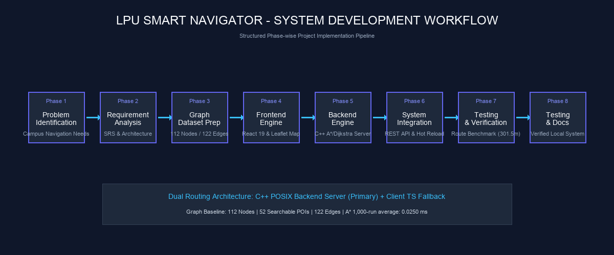
```

**Figure 1.1: High-Level Project Workflow Pipeline**  
*The eight-stage engineering workflow illustrating phase-by-phase progression from initial requirement analysis to local testing and documentation.*

---

### 1.12 Chapter Summary

This chapter introduced the background, motivation, problem statement, and scope for the **LPU Smart Navigator / LPU Pathfinder** project. Navigating a large university campus requires a dedicated pedestrian navigation tool that addresses the limitations of generic public mapping services. The proposed system meets this requirement by pairing a C++ backend routing engine (A* + Dijkstra) with a React 19 / Leaflet web interface, supported by a client-side TypeScript routing fallback and an administrative graph editor.

The subsequent chapters detail the technical implementation of the system:
- **Chapter 2** covers system analysis, functional and non-functional requirements, and the software technology stack.
- **Chapter 3** describes system architecture, frontend components, C++ backend implementation, pathfinding algorithm logic, API endpoints, data models, and administrative tools.
- **Chapter 4** presents empirical testing results, route verification benchmarks, comparative performance analysis, and administrative editor evaluations.
- **Chapter 5** concludes the report with a synthesis of achievements, system limitations, and potential future enhancements.

---

<br/>

# CHAPTER 2

# SYSTEM ANALYSIS AND REQUIREMENTS

### 2.1 Requirement Analysis

System analysis for the **LPU Smart Navigator / LPU Pathfinder** project involved establishing the functional capabilities, non-functional characteristics, operational constraints, and technology dependencies required to deliver a reliable web-based campus navigation system.

Requirements were derived by analyzing user navigation workflows across Lovely Professional University's campus geography, identifying the shortcomings of generic commercial map services, and determining the technical requirements for sub-millisecond pathfinding over a campus graph network.

Requirements are structured into distinct categories:
- **Functional Requirements**: Core software operations, interactive features, algorithm executions, API endpoints, and administrative management capabilities (**VERIFIED**).
- **Quality & Non-Functional Characteristics**: Usability, maintainability, data validation integrity, browser compatibility, and fallback availability (**VERIFIED**).
- **Development & Technical Constraints**: Operational constraints including C++20 language standards, POSIX socket interface boundaries, OpenStreetMap tile usage, and LocalStorage client constraints (**VERIFIED**).
- **Observed Performance Characteristics**: Empirical timing measurements recorded during route execution testing (distinguishing between single-run logging executions and 1,000-run optimized averages) rather than arbitrary SLA requirements (**MEASURED**).

---

### 2.2 Stakeholders and Intended Users

The system supports four distinct primary user roles within the institutional environment:

1. **New Students & Admissions Candidates**: Primary users seeking directional guidance between entrance gates, admission centers, academic blocks, examination centers, and student residential hostels.
2. **Campus Guests & Visiting Parents**: Occasional visitors requiring clear walking routes from primary campus entry gates (such as *Main Gate / Tungstile*) to administrative offices, residential complexes, auditoriums, or health facilities.
3. **Faculty & Staff Personnel**: Institutional staff members seeking optimal walking paths to inter-departmental blocks, conference venues, or central facilities across campus sectors.
4. **Campus Administrators & Graph Maintainers**: Authorized technical personnel responsible for maintaining graph data integrity, splitting path segments, adding newly constructed campus facilities, and updating edge distances via the interactive Administrative Graph Editor.

---

### 2.3 Functional Requirements

The functional requirements of **LPU Smart Navigator** define the verified actions and behaviors supported by the system implementation.

<br/>

#### Table 2.1: Functional Requirements

| Requirement ID | Module / Area | Description of Functionality | Implementation Status |
| :--- | :--- | :--- | :--- |
| **FR-01** | POI Search & Indexing | The system shall maintain an indexed dataset of **52 searchable Points of Interest (POIs)**, filtering out hidden navigation junction waypoints. | **VERIFIED** (Implemented in `SearchIndex.cpp` & `NavigationPanel.tsx`) |
| **FR-02** | Location Selection | The system shall provide interactive searchable dropdown controls enabling users to select distinct starting and destination nodes. | **VERIFIED** (Implemented in `NavigationPanel.tsx`) |
| **FR-03** | Primary Route Calculation | The system shall execute primary pathfinding using the **A\* Search algorithm** utilizing the Haversine distance heuristic. | **VERIFIED** (Implemented in `AStarRouter.cpp` & `aStarRouter.ts`) |
| **FR-04** | Route Verification | The system shall execute **Dijkstra's Algorithm** concurrently in development verification mode to validate optimal path distance matching. | **VERIFIED** (Implemented in `DijkstraRouter.cpp` & `RoutingManager.cpp`) |
| **FR-05** | Distance & Time Estimation | The system shall return total walking distance (meters) and calculated walking time (seconds, based on standard 1.4 m/s walking speed). | **VERIFIED** (Implemented in `RoutingManager.cpp`) |
| **FR-06** | Interactive Map Overlay | The system shall render continuous polyline geometry representing the calculated path on an interactive Leaflet map overlay. | **VERIFIED** (Implemented in `MapView.tsx`) |
| **FR-07** | Dual-Routing Fallback | The system shall fallback to an in-browser client-side TypeScript A\* routing engine if the C++ backend HTTP server is offline. | **VERIFIED** (Implemented in `aStarRouter.ts` & `NavigationPanel.tsx`) |
| **FR-08** | Graph Data Validation | The system shall validate graph connectivity on startup, detecting duplicate node/edge IDs, zero-distance edges, missing endpoints, and orphan nodes. | **VERIFIED** (Implemented in `Graph.cpp`) |
| **FR-09** | Admin Authentication | The system shall enforce credential-based authentication (`dips006`) prior to granting administrative graph editing privileges. | **VERIFIED** (Implemented in `MapView.tsx`) |
| **FR-10** | Admin Node & Edge Editing | The administrative editor shall allow adding nodes, dragging markers, and splitting existing edge segments at precise coordinates. | **VERIFIED** (Implemented in `MapView.tsx`) |
| **FR-11** | Graph Persistence & Hot Reload | The backend shall handle `POST /api/save-graph`, writing updated JSON graph data to disk (`nodes.json` & `edges.json`) and hot-reloading in-memory graph structures. | **VERIFIED** (Implemented in `HttpServer.cpp` & `apiClient.ts`) |
| **FR-12** | Outdoor GPS Voice Guidance | Turn-by-turn spoken audio prompts during active user movement. | **OUT OF SCOPE** (Not implemented) |

---

### 2.4 Non-Functional Requirements

Non-functional requirements describe quality attributes, maintainability standards, structural constraints, and observed performance characteristics.

<br/>

#### Table 2.2: Non-Functional Requirements

| Property Category | Quality Attribute | Technical Specification & Implementation Rationale | Status Classification |
| :--- | :--- | :--- | :--- |
| **Usability** | User Experience & Clarity | Clean responsive interface built with Tailwind CSS, supporting dark mode aesthetics, intuitive search dropdowns, clear polyline overlays, and distinct POI markers. | **VERIFIED** |
| **Maintainability** | Codebase Architecture | Modular separation between C++ backend modules (`Graph`, `RoutingManager`, `SearchIndex`, `HttpServer`) and React 19 frontend components (`MapView`, `NavigationPanel`, `apiClient`). | **VERIFIED** |
| **Data Integrity** | Graph Validation Rules | Graph initialization enforces 0 orphan edge references, positive edge distances (>0m), and automatic geometry generation for missing polyline endpoints. | **VERIFIED** |
| **Fault Tolerance** | Dual Routing Fallback | In-browser TypeScript A\* routing fallback ensures continuous route calculation availability if backend server connectivity is lost. | **VERIFIED** |
| **Compatibility** | Web Standards | Compatible with modern ECMAScript 2022+ web browsers (Chrome, Firefox, Safari, Edge) supporting HTML5 canvas and Leaflet tile rendering. | **VERIFIED** |
| **Performance** | Observed Timing Property | Pathfinding operations exhibit sub-millisecond execution times in local testing environments (Single verification run: A\* 0.311 ms; 1,000-run optimized average: A\* 0.0250 ms). | **MEASURED** |

---

### 2.5 Hardware Requirements

A standard development computer capable of building the C++20 backend, running the frontend development environment (Node.js/Vite), and serving a modern web browser is sufficient for the current system prototype.

#### Development & Runtime Hardware Baseline:
- **Processor**: Standard x86_64 or ARM64 multi-core CPU.
- **Memory**: Standard system memory adequate for Node.js build tooling and modern web browser tab execution (the compiled C++ backend executable itself consumes under 15 MB of RAM in memory).
- **Storage**: Standard local disk storage for source files, compiled backend binary, and JSON graph datasets (`nodes.json` and `edges.json`).
- **Display & Input**: Standard high-resolution display with mouse/touch pointer input for Leaflet map interaction.

---

### 2.6 Software Requirements

The software environment utilizes verified tools and runtime configurations established in the project repository:

- **Operating System**: POSIX-compatible operating system (macOS, Linux, or Windows with WSL).
- **C++ Compiler**: C++20-compliant compiler (Apple Clang 15.0+ or GCC 11+).
- **Build System**: **CMake 3.16+** (`cmake_minimum_required(VERSION 3.16)`).
- **Runtime Environment**: **Node.js v18.0+ / v20.0+**.
- **Frontend Tooling**: **Vite 8.2+** (`vite` ^8.2.0), **React 19** (`react` ^19.2.8), **TypeScript** (`typescript` ~6.0.2).
- **Code Quality Tooling**: **Oxlint 1.75+** (`oxlint` ^1.75.0).
- **Web Browser**: Any modern web browser supporting HTML5, Fetch API, and Leaflet map rendering.

---

### 2.7 Technology Stack

The technology stack combines frontend presentation tools with a high-performance C++ backend engine.

<br/>

#### Table 2.3: Technology Stack Specification

| Technology Layer | Tool / Library | Verified Version | Functional Rationale in Project |
| :--- | :--- | :--- | :--- |
| **Frontend Core** | React | 19.2.8 | Powers the component-driven user interface, managing state for selected nodes, active routes, and modal forms. |
| **Language Framework** | TypeScript | 6.0.2 | Ensures end-to-end type safety for node items, edge items, route results, and API request/response interfaces. |
| **Build Tool** | Vite | 8.2.0 | Delivers fast frontend module serving, Hot Module Replacement (HMR), and production bundling. |
| **UI Styling** | Tailwind CSS | 4.3.3 | Provides utility-first styling for dark-mode panels, modal popups, buttons, search dropdowns, and responsiveness. |
| **Map Rendering** | Leaflet / React-Leaflet | 1.9.4 / 5.0.0 | Renders interactive maps, tile layers, dynamic markers, popups, and polyline route paths. |
| **Tile Provider** | OpenStreetMap | Standard Tile Server | Provides open map tile graphics for campus spatial overlay visualization. |
| **Backend Language** | C++ | C++20 Standard | Implements high-performance graph algorithms, memory-efficient data structures, and POSIX socket listener. |
| **Backend Build System** | CMake | 3.16+ | Manages compilation of C++ source files into executable binary `lpu_smart_navigator_backend`. |
| **Network Interface** | POSIX Sockets | Native OS Sockets | Listens on port `8080`, handling raw HTTP requests (`POST /api/route` & `POST /api/save-graph`) with CORS support. |
| **Data Format** | JSON | Standard Specification | Format for dataset files (`nodes.json`, `edges.json`) and HTTP API payload exchanges. |
| **Client Storage** | LocalStorage | Web Storage API | Persists working datasets and administrative authentication tokens across browser sessions. |
| **Linter** | Oxlint | 1.75.0 | Executes fast static code analysis for TypeScript files to maintain code quality. |

---

### 2.8 Feasibility Analysis

#### Technical Feasibility
The technical architecture combines a C++ backend engine with a React web interface. C++ provides efficient memory usage and fast execution times for graph traversals, while React and Leaflet offer responsive UI rendering. The inclusion of a client-side TypeScript fallback engine guarantees that routing capabilities remain functional even if the backend server becomes unreachable, demonstrating strong technical feasibility.

#### Operational Feasibility
The operational user flow requires minimal technical familiarity. Users select starting and destination locations from searchable POI dropdowns and view walking routes displayed directly on the interactive map. The administrative workflow allows authorized staff to edit map nodes and paths directly through visual point-and-click tools without editing raw JSON files manually.

#### Economic Feasibility
The software architecture relies on open-source frameworks (React, Leaflet, C++, CMake, Vite) and open map tile data (OpenStreetMap). The system operates on standard workstation hardware without requiring specialized server infrastructure or proprietary mapping license fees, demonstrating economic feasibility.

#### Legal & Licensing Considerations
The project uses open-source software libraries and external map tiles from OpenStreetMap. Production or institutional deployment should review applicable attribution, licensing, and usage terms associated with map tile usage (ODbL license) and underlying open-source software licenses (MIT/BSD).

---

### 2.9 Existing System vs Proposed System

The proposed system addresses the limitations of standard paper maps and commercial navigation engines for institutional campus navigation.

<br/>

#### Table 2.4: Comparative Analysis: Existing Methods vs Proposed System

| Functional Feature | Static Print / PDF Maps | Commercial Navigation Apps | LPU Smart Navigator (Proposed) |
| :--- | :--- | :--- | :--- |
| **Campus Pedestrian Data** | Static visual map | Primarily vehicular roads | **Dedicated pedestrian path network (122 edges)** |
| **Building Entrance Routing** | Visual inspection only | Centroid / road address | **Specific entrance gate node indexing** |
| **Campus POI Indexing** | Manual map scanning | General commercial places | **52 specialized campus POIs Indexed** |
| **Automated Route Calculation**| Not supported | Supported (road focus) | **Supported (A\* + Dijkstra pedestrian routing)** |
| **Walking Time Estimation** | Manual calculation | Fixed estimation | **Calculated based on 1.4 m/s pedestrian speed** |
| **Interactive Map UI** | Static image | Interactive vector/tile map | **Interactive Leaflet tile map with polyline overlays** |
| **Admin Graph Editor** | Not supported | Not supported (vendor controlled) | **Integrated admin node/edge editor with hot reload** |
| **Dual-Engine Resilience** | N/A | Server dependent | **C++ POSIX server + Client TypeScript fallback** |

---

### 2.10 System Architecture

The architecture of **LPU Smart Navigator** follows a tiered model combining client-side rendering, API communication, backend C++ graph calculation, and persistent JSON data storage.

```markdown
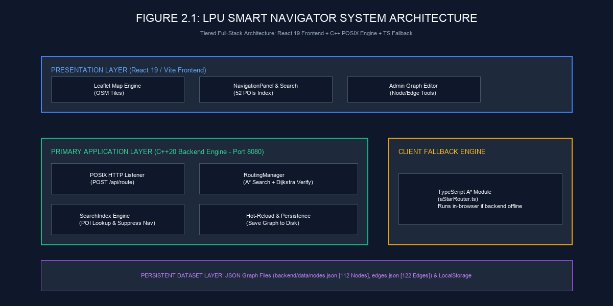
```

**Figure 2.1: System Architecture Diagram**  
*The multi-tier system architecture illustrating the React presentation layer, C++ POSIX backend application engine, client-side TypeScript fallback module, and JSON storage layer.*

#### Architecture Layers:
1. **Presentation Layer (React 19 / Leaflet)**: Manages map visualization, user search controls, polyline drawing, and admin modal forms.
2. **API Communication Layer**: Sends HTTP requests (`POST /api/route` & `POST /api/save-graph`) to the C++ server using standard JSON payloads.
3. **Application & Routing Layer (C++ Backend Engine)**: Listens on port `8080`, parses JSON queries, runs A* pathfinding with Dijkstra verification, and formats JSON route outputs.
4. **Client Fallback Layer (aStarRouter.ts)**: Executes in-browser TypeScript A* pathfinding if the C++ server is unreachable.
5. **Data Layer**: Stores graph configuration files (`nodes.json` and `edges.json`) on disk, reloaded into memory upon startup or admin save actions.

---

### 2.11 Use Case Analysis

The system supports key operational use cases for general users and system administrators:

- **UC-1: Search & Filter Campus POIs**: Users search locations by name or category, filtering out hidden junction nodes.
- **UC-2: Select Start & Destination Points**: Users pick origin and destination points from dropdowns or map markers.
- **UC-3: Request Optimal Route**: Users trigger route calculation, sending queries to the routing engine.
- **UC-4: View Distance, Walking Time & Route Polyline**: Users inspect total distance (meters), estimated walk time (minutes/seconds), and the highlighted path on the map.
- **UC-5: Admin Login Authentication**: Administrators authenticate using credentials (`dips006`) to unlock editor features.
- **UC-6: Interactive Node Creation & Dragging**: Administrators add nodes by clicking map coordinates or adjusting positions.
- **UC-7: Split Path Segment & Save to Disk**: Administrators insert nodes along existing edges, split geometry (`splitEdgeAtNode`), validate graph data, and persist changes to disk.

---

### 2.12 Use Case Diagram

The relationship between system actors (User and Administrator) and supported operational use cases is illustrated in **Figure 2.2**.

```markdown
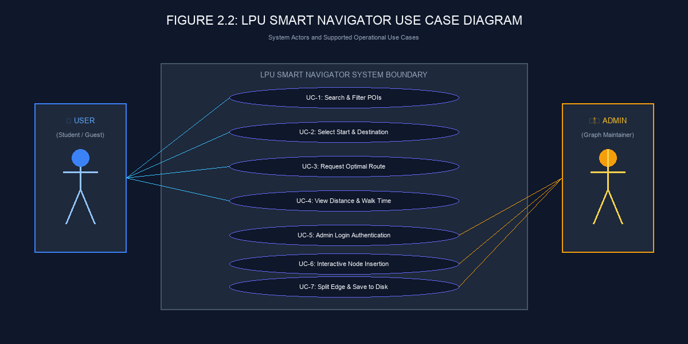
```

**Figure 2.2: Use Case Diagram**  
*Use case diagram depicting actor interactions for general campus navigation and administrative graph maintenance.*

---

### 2.13 Application / System Flow

The operational flow for user route requests (including dual-engine fallback) and administrative graph editing is illustrated in **Figure 2.3**.

```markdown
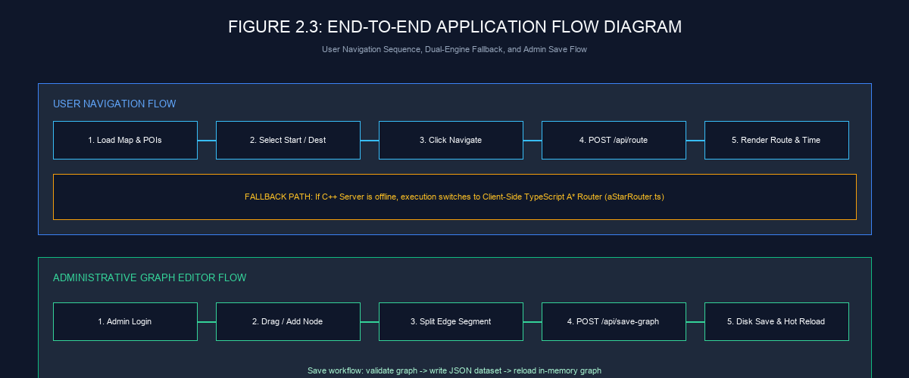
```

**Figure 2.3: End-to-End Application Flow Diagram**  
*End-to-end application flow showing user navigation query processing, client-side fallback handling, and administrative graph modification workflows.*

---

### 2.14 Chapter Summary

This chapter detailed the system analysis, functional and non-functional requirements, technical feasibility, software stack, and architecture for **LPU Smart Navigator / LPU Pathfinder**. 

Functional requirements were specified across 11 verified system capabilities (**Table 2.1**), alongside observed non-functional characteristics (**Table 2.2**) and the technology stack (**Table 2.3**). The system architecture (**Figure 2.1**), use case model (**Figure 2.2**), and end-to-end operational flow (**Figure 2.3**) demonstrate a resilient multi-tier design combining a C++ backend engine with a React 19 frontend and an in-browser TypeScript fallback.

The next chapter (**Chapter 3: System Design and Implementation**) presents the technical implementation details of the frontend components, C++ graph engine, pathfinding algorithms, HTTP server engine, API schemas, and administrative graph editor.

---

<br/>

# CHAPTER 3

# SYSTEM DESIGN AND IMPLEMENTATION

## PART 3 — FRONTEND, UI AND USER INTERACTION

### 3.1 System Design Overview

The frontend presentation layer of **LPU Smart Navigator / LPU Pathfinder** provides an interactive web interface for navigating Lovely Professional University's campus. Built as a single-page web application using **React 19**, **TypeScript**, and **Leaflet**, the frontend renders OpenStreetMap tile layers, displays campus points of interest (POIs), manages location selection, and visualizes calculated walking routes as blue polyline overlays.

Architecturally, the frontend operates as the user-facing client in a decoupled client-server model. When a user requests directions, the frontend packages the selected origin and destination node IDs into a JSON HTTP request and transmits it to the C++ backend routing engine listening on port `8080`. Upon receiving the path result, the frontend updates component state, renders walking statistics (distance in meters/kilometers and estimated walk time), and plots the polyline geometry over the interactive map.

---

### 3.2 Frontend Architecture

The frontend implementation relies on a component-driven architecture built with modern web technologies:

- **React 19**: Serves as the core UI framework, managing application state, state synchronization between map markers and navigation dropdowns, and modal dialog lifecycle.
- **TypeScript (`~6.0.2`)**: Enforces static type safety across dataset interfaces (`NodeItem`, `EdgeItem`), API request/response payloads (`RouteResult`, `SaveGraphResponse`), and component prop types.
- **Vite (`^8.2.0`)**: Handles development module serving with Hot Module Replacement (HMR) and optimized production compilation.
- **Tailwind CSS (`^4.3.3`)**: Implements utility-first styling for dark-mode overlays (`bg-slate-900/95`), responsive layout panels, rounded controls, and modal forms.
- **Leaflet (`^1.9.4`) & React-Leaflet (`^5.0.0`)**: Provides map container rendering, zoom/pan controls, marker positioning, popups, and polyline route visualization.

The frontend source code is organized cleanly within `frontend/src/`:
- `main.tsx`: Application entry point initializing React DOM rendering.
- `App.tsx`: Top-level application container rendering the core map view (`MapView`).
- `components/MapView.tsx`: Primary map container managing Leaflet layers, POI markers, route polylines, map event hooks, and administrative graph editor tools.
- `components/NavigationPanel.tsx`: Overlay control header containing searchable POI selectors, Navigate action trigger, User/Admin mode toggles, and route statistics.
- `utils/apiClient.ts`: HTTP communication module executing backend API calls (`fetchRouteFromBackend` and `saveGraphToBackend`).
- `utils/aStarRouter.ts`: Client-side TypeScript A* routing engine serving as an in-browser fallback when the C++ server is offline.
- `utils/dijkstraRouter.ts`: TypeScript interface definitions for nodes, edges, adjacent lists, and route results.

---

### 3.3 React Component Structure

The frontend component hierarchy separates map rendering, user navigation inputs, administrative editor dialogs, and utility modules into modular layers.

```markdown
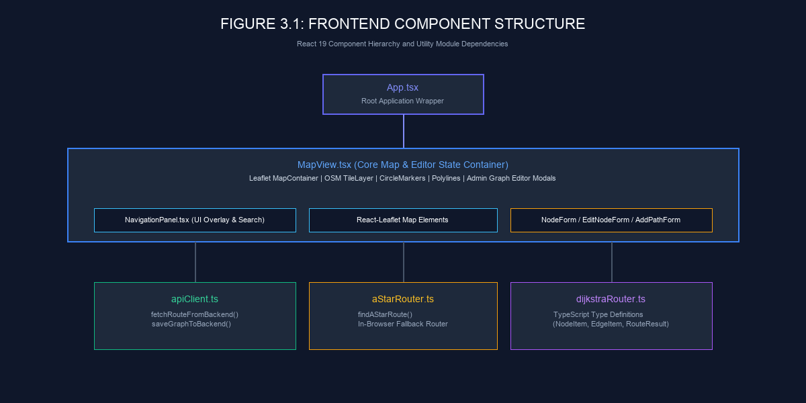
```

**Figure 3.1: Frontend Component Structure**  
*The React 19 component hierarchy illustrating top-level App.tsx, core MapView.tsx, NavigationPanel.tsx overlay, administrative modal forms, and utility module dependencies.*

#### Component Responsibilities:
1. `App.tsx`: Serves as the application root component, instantiating `<MapView />`.
2. `MapView.tsx`: Controls Leaflet map lifecycle, maintains working datasets (`nodes` and `edges`), manages admin mode authorization state, handles map click events, renders polyline geometry, and presents admin forms (`NodeForm`, `EditNodeForm`, `InsertNavNodeForm`, `AddPathForm`).
3. `NavigationPanel.tsx`: Renders the responsive top navigation bar containing searchable POI selection inputs (`SearchableSelect`), user/admin toggle buttons, and the calculated route summary card.
4. `apiClient.ts`: Encapsulates asynchronous `fetch` calls to backend API endpoints (`http://localhost:8080/api/route` and `http://localhost:8080/api/save-graph`).

---

### 3.4 MapView.tsx Implementation

`MapView.tsx` is the primary component managing map visualization, Leaflet tile layers, node markers, route polylines, and administrative graph editor interactions.

#### Key Implemented Responsibilities:
- **Leaflet Map Container**: Renders `<MapContainer>` centered on campus coordinates (`[31.2536, 75.7037]`) with zoom boundaries (`minZoom: 15`, `maxZoom: 22`).
- **OpenStreetMap Tile Layer**: Displays standard OSM tiles (`https://{s}.tile.openstreetmap.org/{z}/{x}/{y}.png`).
- **POI & Navigation Markers**: Iterates over campus node datasets, rendering `<CircleMarker>` elements colored by category (indigo for POIs, cyan/slate for navigation waypoints).
- **Route Polyline Rendering**: Renders a blue `<Polyline>` overlay matching the geometry coordinate points returned by the routing engine.
- **Administrative Editor Logic**: Manages marker dragging (`dragend` events), snap-to-edge calculations (`findNearestPointOnEdge`), and edge splitting (`splitEdgeAtNode`) when new nodes are inserted along existing paths.

The following TSX code snippet illustrates the Leaflet map container and route polyline rendering setup in `MapView.tsx`:

```tsx
// Excerpt from frontend/src/components/MapView.tsx
<MapContainer
  center={LPU_COORDINATES}
  zoom={INITIAL_ZOOM}
  minZoom={MIN_ZOOM}
  maxZoom={MAX_ZOOM}
  className="w-full h-full z-0"
>
  <TileLayer
    attribution='&copy; <a href="https://www.openstreetmap.org/copyright">OpenStreetMap</a> contributors'
    url="https://{s}.tile.openstreetmap.org/{z}/{x}/{y}.png"
    maxNativeZoom={MAX_NATIVE_ZOOM}
    maxZoom={MAX_ZOOM}
  />

  {/* Active Route Blue Polyline Overlay */}
  {routeResult && routeResult.found && routeResult.geometry && routeResult.geometry.length > 1 && (
    <Polyline
      positions={routeResult.geometry}
      pathOptions={{
        color: '#38bdf8',
        weight: 6,
        opacity: 0.9,
        lineCap: 'round',
        lineJoin: 'round',
      }}
    />
  )}
</MapContainer>
```

*The TSX snippet above demonstrates the declarative Leaflet map container configuration and the conditional rendering of the calculated route polyline.*

---

### 3.5 NavigationPanel.tsx Implementation

`NavigationPanel.tsx` implements the responsive top-level floating panel containing location search inputs, mode switches, and route summary cards.

#### Key Implemented Responsibilities:
- **Searchable Select Dropdowns**: Hosts two `<SearchableSelect />` instances for selecting starting and destination nodes.
- **POI Deduplication & Filtering**: Filters out hidden navigation junction waypoints (`isHidden === true` or `category === 'Navigation'`), exposing **52 searchable POIs**.
- **Navigate Action Trigger**: Validates origin and destination selections, invoking `fetchRouteFromBackend()` asynchronously.
- **Route Summary Card**: Displays total walking distance (formatted in meters or kilometers), estimated walking time (formatted in minutes and seconds), traversed node count, and a clear button.
- **Mode Toggle & Admin Login Trigger**: Switches between User Mode and Admin Mode, opening the admin authentication modal when required.

The following TSX snippet highlights the POI deduplication and filtering logic in `NavigationPanel.tsx`:

```tsx
// Excerpt from frontend/src/components/NavigationPanel.tsx
const poiOptions = useMemo(() => {
  const nodeDegrees = new Map<string, number>()
  nodes.forEach((n) => nodeDegrees.set(n.id, 0))
  edges.forEach((e) => {
    nodeDegrees.set(e.fromNodeId, (nodeDegrees.get(e.fromNodeId) || 0) + 1)
    nodeDegrees.set(e.toNodeId, (nodeDegrees.get(e.toNodeId) || 0) + 1)
  })

  // Filter valid POIs and prioritize connected nodes over isolated duplicates
  const validPois = nodes.filter((n) => !n.isHidden && n.category !== 'Navigation')
  const bestPoisMap = new Map<string, NodeItem>()
  const bestDegreeMap = new Map<string, number>()

  validPois.forEach((n) => {
    const lowerName = n.name.toLowerCase().trim()
    const deg = nodeDegrees.get(n.id) || 0
    const existingDeg = bestDegreeMap.get(lowerName)

    if (!bestPoisMap.has(lowerName) || (existingDeg !== undefined && deg > existingDeg)) {
      bestPoisMap.set(lowerName, n)
      bestDegreeMap.set(lowerName, deg)
    }
  })

  return Array.from(bestPoisMap.values()).sort((a, b) => a.name.localeCompare(b.name))
}, [nodes, edges])
```

*The code snippet above shows the `useMemo` filter logic that isolates 52 unique POIs while filtering out hidden navigation junction nodes.*

---

### 3.6 Searchable POI Selection

Location selection in **LPU Smart Navigator** utilizes the `SearchableSelect` dropdown component. Users click the input trigger to open an interactive search popup, where typing dynamically filters matching locations by name or type (e.g., *hospital*, *library*, *entrance*, *food court*).

```markdown
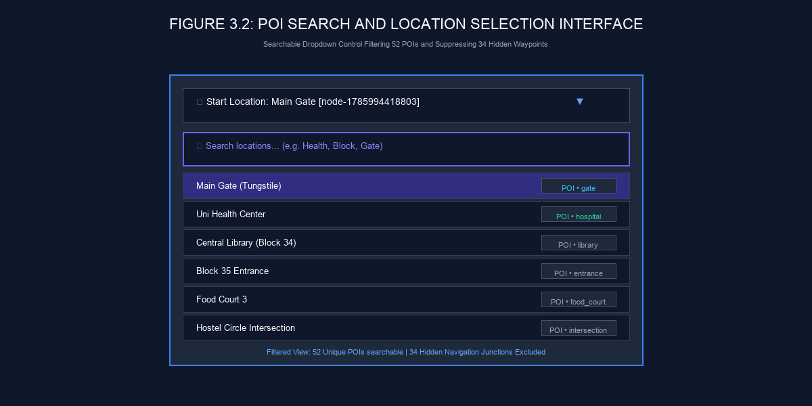
```

**Figure 3.2: POI Search and Location Selection Interface**  
*The interactive location dropdown interface filtering 52 searchable campus POIs while excluding 34 hidden navigation waypoints.*

#### Search Characteristics:
- **52 Indexed POIs**: Exposes meaningful campus destinations (*Main Gate*, *Uni Health Center*, *Central Library (Block 34)*, *Block 35 Entrance*, *Food Court 3*, *Hostel Plazas*).
- **Hidden Junction Suppression**: Excludes **34 hidden navigation junction waypoints** (`node-nav-...`) from dropdown search lists, keeping the interface uncluttered.
- **Alphabetical Sorting**: Presents locations in clean alphabetical order for rapid browsing.

---

### 3.7 Leaflet and React-Leaflet Integration

The application integrates Leaflet map rendering into React's component lifecycle through `react-leaflet` wrapper components:

- **`<MapContainer>`**: Initializes the Leaflet map instance, handling pan bounds (`LPU_BOUNDS`) and touch/mouse gesture listeners.
- **`<TileLayer>`**: Connects to OpenStreetMap tile servers to stream background raster map tiles.
- **`<CircleMarker>`**: Renders circular vector markers representing campus nodes at WGS84 latitude/longitude coordinates.
- **`<Polyline>`**: Renders dynamic SVG/Canvas line segments corresponding to calculated route polyline geometry arrays.
- **`<Popup>` & `<Tooltip>`**: Displays location names, node IDs, category tags, and admin editing actions upon marker interaction.

OpenStreetMap provides the general spatial background graphics, while the project's custom C++ graph engine and dataset supply the campus-specific node locations, edge paths, and routing calculations.

---

### 3.8 OpenStreetMap Integration

OpenStreetMap (OSM) serves as the visual cartographic backdrop for the application. Standard OSM raster tiles (`https://{s}.tile.openstreetmap.org/{z}/{x}/{y}.png`) are fetched dynamically by the browser to display geographic context including surrounding roads, green areas, and external boundaries.

The custom LPU campus graph (112 nodes and 122 edges) is overlaid directly onto these OSM tiles using exact WGS84 latitude/longitude coordinates. This layer separation ensures that campus pedestrian path routing operates entirely on verified internal graph geometry independently of third-party map tile providers.

---

### 3.9 Route Request Flow

The end-to-end frontend route request workflow follows a structured execution sequence upon user interaction:

```markdown
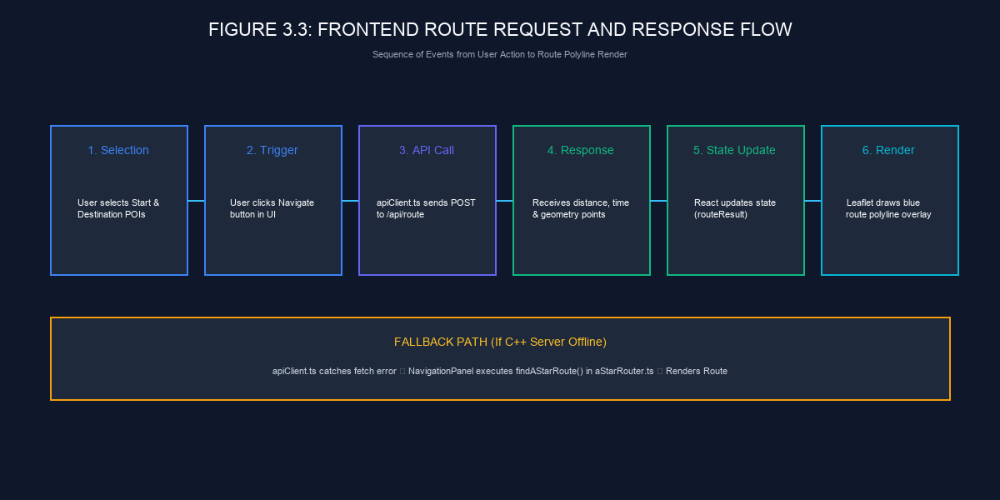
```

**Figure 3.3: Frontend Route Request and Response Flow**  
*Sequence of execution from user location selection and Navigate click to backend API communication, state update, and map polyline overlay rendering.*

#### Execution Steps:
1. **Selection**: User selects an origin node (e.g., *Main Gate*) and destination node (e.g., *Uni Health Center*).
2. **Trigger**: User clicks the **Navigate** button in `NavigationPanel.tsx`.
3. **API Dispatch**: `NavigationPanel` calls `fetchRouteFromBackend(startNodeId, destinationNodeId)` in `apiClient.ts`.
4. **HTTP Exchange**: `apiClient.ts` sends `POST http://localhost:8080/api/route` containing JSON payload `{"startNodeId": "...", "destinationNodeId": "..."}`.
5. **Response Processing**: Backend returns JSON payload containing `totalDistance` (301.5 m), `walkingTime` (215.4 s), `nodeIds`, `edgeIds`, and `geometry` coordinate arrays.
6. **State & Map Render**: `NavigationPanel` updates `routeResult` state; `MapView` re-renders the blue `<Polyline>` overlay and presents the route summary card.

---

### 3.10 apiClient.ts Implementation

`apiClient.ts` serves as the centralized HTTP API communication module for the frontend application.

#### Documented API Functions:
- **`fetchRouteFromBackend(startNodeId, destinationNodeId)`**: Formats HTTP POST requests to `http://localhost:8080/api/route` and parses returned JSON route results.
- **`saveGraphToBackend(nodes, edges)`**: Formats HTTP POST requests to `http://localhost:8080/api/save-graph` for administrative dataset persistence. *(Invoked strictly during administrative save operations)*.

The following TypeScript code snippet illustrates `fetchRouteFromBackend()` implementation:

```typescript
// Excerpt from frontend/src/utils/apiClient.ts
const BACKEND_BASE_URL = 'http://localhost:8080'

export const fetchRouteFromBackend = async (
  startNodeId: string,
  destinationNodeId: string
): Promise<RouteResult> => {
  const response = await fetch(`${BACKEND_BASE_URL}/api/route`, {
    method: 'POST',
    headers: {
      'Content-Type': 'application/json',
    },
    body: JSON.stringify({ startNodeId, destinationNodeId }),
  })

  if (!response.ok) {
    throw new Error(`Backend HTTP Error: ${response.status} ${response.statusText}`)
  }

  const data = (await response.json()) as RouteResult
  return data
}
```

*The code snippet above highlights the asynchronous fetch call transmitting JSON route queries to the C++ HTTP server.*

---

### 3.11 Route Result Display

Once a route calculation completes, the interface presents path statistics within a dedicated summary card in `NavigationPanel.tsx`:

- **Route Origin & Destination**: Displays location names (*Main Gate ➔ Uni Health Center*).
- **Total Walking Distance**: Formatted dynamically in meters (e.g., **301.5 m**) for paths under 1,000 meters, or kilometers (e.g., **1.25 km**) for longer paths.
- **Estimated Walking Time**: Calculated at standard walking speed (1.4 m/s) and displayed in minutes and seconds (e.g., **3m 35s**).
- **Traversed Node Count**: Shows the total number of nodes in the path sequence (e.g., **8 nodes**).
- **Clear Action**: Provides a **Clear ✕** button that resets route state and removes the polyline overlay from the map.

---

### 3.12 User Navigation Mode

The standard user workflow supports intuitive campus navigation through six steps:

1. **Open Application**: The user accesses the web application, rendering the LPU campus map view.
2. **Select Start Location**: The user selects their origin location (*Main Gate*) from the **📍 Start** dropdown.
3. **Select Destination**: The user selects their destination (*Uni Health Center*) from the **🎯 Dest** dropdown.
4. **Trigger Navigation**: The user clicks **🧭 Navigate**.
5. **Inspect Route Overlay**: The application highlights the walking path on the map with a blue polyline overlay.
6. **Review Walking Stats**: The user reads total walking distance (**301.5 m**) and estimated walking time (**3m 35s**).

---

### 3.13 Responsive and Visual Design

The UI styling utilizes **Tailwind CSS 4**, applying a modern dark theme design system:

- **Color Palette**: Dark slate panels (`bg-slate-900/95`), indigo highlights (`bg-indigo-600`), cyan accents (`text-cyan-400`), and emerald stats badges (`bg-emerald-950/80`).
- **Backdrop Blur & Glassmorphism**: Floating panels apply `backdrop-blur-md` and subtle border highlights (`border-slate-700/80`) to remain legible over map tiles.
- **Flexbox & Grid Alignment**: Input dropdowns and action buttons use flexible layouts (`flex items-center justify-between`) that adjust across desktop and tablet screen widths.

---

### 3.14 Client-Side Routing Fallback — Frontend Perspective

To maintain operational resilience, `NavigationPanel.tsx` includes an error-handling block around API calls. If `fetchRouteFromBackend()` fails (such as when the C++ backend server is offline), the frontend catches the error and executes `findAStarRoute()` from `aStarRouter.ts` directly in the browser:

```typescript
// Fallback execution block in NavigationPanel.tsx
try {
  const result = await fetchRouteFromBackend(startNodeId, destNodeId)
  setRouteResult(result)
} catch (err) {
  console.warn('⚠️ C++ Backend Server offline, executing client fallback:', err)
  const fallbackResult = findAStarRoute(nodes, edges, startNodeId, destNodeId)
  setRouteResult(fallbackResult)
}
```

*This fallback mechanism ensures that users receive walking directions even if server-side network connectivity is interrupted.*

---

### 3.15 Frontend Data Flow

The frontend follows React's unidirectional data flow pattern:

```markdown
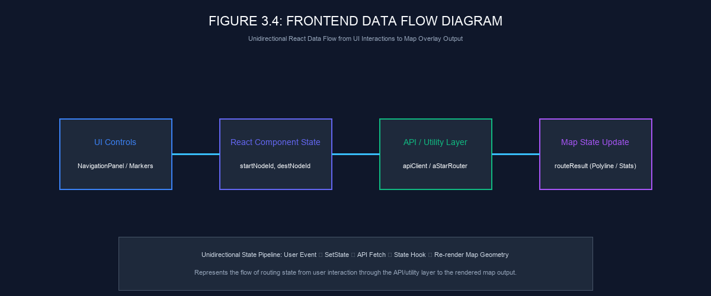
```

**Figure 3.4: Frontend Data Flow Diagram**  
*Unidirectional React data flow pipeline managing state propagation from user interactions to map rendering.*

1. **User Interaction**: User selects POIs or clicks Navigate.
2. **React State Update**: `startNodeId` and `destNodeId` states update in `NavigationPanel`.
3. **API / Fallback Execution**: `apiClient.ts` or `aStarRouter.ts` calculates route geometry.
4. **State Set**: `setRouteResult(result)` updates component state.
5. **Re-Render**: `MapView` re-renders Leaflet `<Polyline>` overlay and route statistics badge.

---

### 3.16 Frontend Implementation Summary

The frontend presentation layer provides an intuitive, responsive mapping interface for the LPU Smart Navigator system. Built with React 19, TypeScript, Vite, Tailwind CSS, and Leaflet, the frontend delivers POI searching across 52 campus locations, interactive location selection, API integration with the C++ backend server, polyline route rendering, client-side fallback resilience, and administrative editor controls.

---

### 3.17 Verified Frontend Interface Screenshots

The following figures present actual browser screenshots captured from the running application operating in standard read-only navigation mode:

```markdown
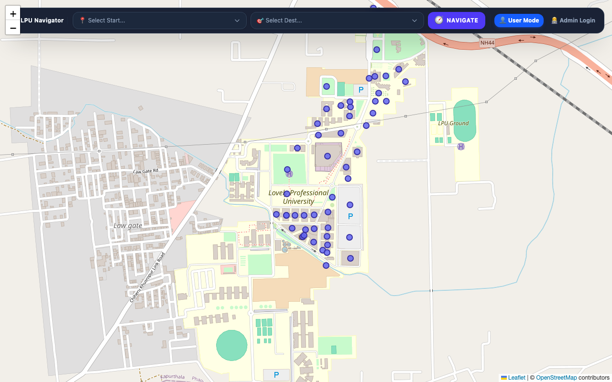
```

**Figure 3.5: Main Navigation Interface Browser Screenshot**  
*Actual browser screenshot showing the primary user interface displaying OpenStreetMap campus map tiles, interactive POI markers, and the floating navigation control panel.*

<br/>

```markdown
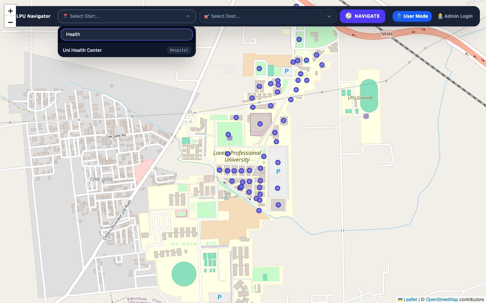
```

**Figure 3.6: POI Search and Location Selection Browser Screenshot**  
*Actual browser screenshot showing the searchable location selection dropdown filtering campus POIs by keyword search while excluding hidden junction waypoints.*

<br/>

```markdown
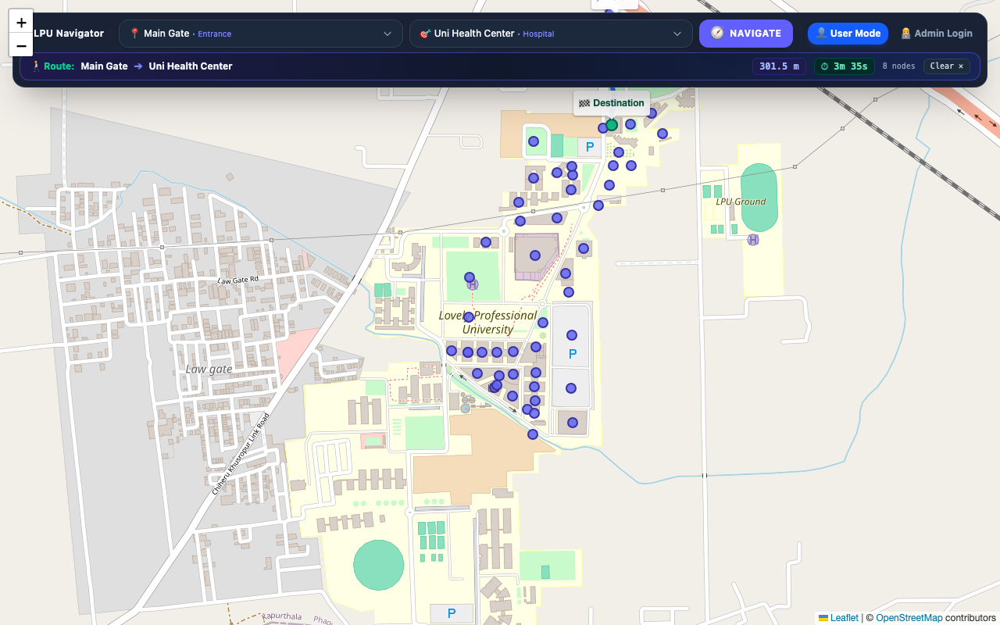
```

**Figure 3.7: Calculated Route Display Browser Screenshot**  
*Actual browser screenshot showing the active route display rendering a blue polyline path overlay between Main Gate and Uni Health Center, accompanied by walking distance (301.5 m) and walking time (3m 35s).*

---

<br/>

## PART 4 — BACKEND, GRAPH ENGINE, ROUTING ALGORITHMS, APIs AND ADMINISTRATION

### 3.17 Backend Architecture

The backend of **LPU Smart Navigator / LPU Pathfinder** is built in **C++20** as a high-performance, standalone HTTP service. The backend server manages in-memory graph storage, handles POI search indexing, computes optimal pedestrian routes using A* Search and Dijkstra algorithms, and listens for incoming HTTP API requests on TCP port `8080`.

Architecturally, the backend is organized into modular classes:

```markdown
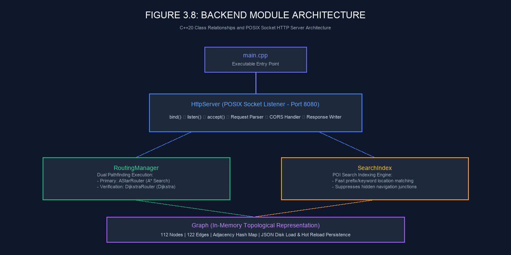
```

**Figure 3.8: Backend Module Architecture**  
*The C++20 backend component architecture illustrating relationships between main.cpp, HttpServer, RoutingManager, SearchIndex, AStarRouter, DijkstraRouter, and the Graph data model.*

#### Module Organization & Responsibilities:
- `main.cpp`: Executable entry point initializing dataset loading, executing verification test routes, and starting the HTTP server daemon.
- `HttpServer`: Native POSIX socket HTTP server listening on port `8080`, handling client connections, parsing raw HTTP request buffers, dispatching API routes (`POST /api/route` and `POST /api/save-graph`), and formatting JSON responses with CORS headers.
- `RoutingManager`: Orchestrates pathfinding queries by delegating primary execution to `AStarRouter` and verification execution to `DijkstraRouter`.
- `Graph`: Central topological data structure maintaining node maps (`unordered_map<string, Node>`) and adjacency lists (`unordered_map<string, vector<AdjEdge>>`). Manages JSON file parsing (`nodes.json` and `edges.json`), graph validation, edge weight calculations, and disk persistence.
- `SearchIndex`: Fast POI search lookup engine filtering searchable locations while suppressing hidden navigation waypoints.
- `AStarRouter`: Primary routing implementation executing A* Search with the Haversine distance heuristic.
- `DijkstraRouter`: Reference routing implementation executing Dijkstra's shortest path algorithm for distance verification.

---

### 3.18 C++20 Backend Implementation

The decision to implement the core routing engine in C++20 provides several distinct engineering advantages:

1. **Native Graph Processing**: C++ compiles directly to native machine instructions, processing graph traversals efficiently without interpreter overhead.
2. **Direct Data Structure Control**: Provides fine-grained control over in-memory adjacency list data structures (`std::unordered_map` and `std::vector`), optimizing memory layout for 112 graph nodes and 122 edges.
3. **Routing and Socket Integration**: Seamlessly integrates custom graph algorithms with POSIX network socket handlers within a unified compiled binary.
4. **Build System Compatibility**: Aligns directly with standard C++ build toolchains managed by CMake (`backend/CMakeLists.txt`).

---

### 3.19 CMake Build Configuration

The C++ backend build lifecycle is managed using **CMake 3.16+**. The `CMakeLists.txt` file specifies language standards, compiler flags, header inclusion paths, and source compilation targets.

```cmake
# Excerpt from backend/CMakeLists.txt
cmake_minimum_required(VERSION 3.16)
project(LPU_Smart_Navigator_Backend VERSION 1.0.0 LANGUAGES CXX)

set(CMAKE_CXX_STANDARD 20)
set(CMAKE_CXX_STANDARD_REQUIRED ON)
set(CMAKE_CXX_EXTENSIONS OFF)

include_directories(${CMAKE_CURRENT_SOURCE_DIR}/include)

add_executable(lpu_smart_navigator_backend
    main.cpp
    src/Graph.cpp
    src/SearchIndex.cpp
    src/DijkstraRouter.cpp
    src/AStarRouter.cpp
    src/RoutingManager.cpp
    src/HttpServer.cpp
)
```

*The CMake configuration above enforces the C++20 language standard and compiles the seven C++ source files into the binary `lpu_smart_navigator_backend`.*

---

### 3.20 Native POSIX Socket HTTP Server

The backend implements a custom HTTP socket server in `HttpServer.cpp` using native POSIX networking APIs (`socket()`, `bind()`, `listen()`, `accept()`, `send()`).

#### Operational Socket Flow:
1. **Socket Initialization**: Creates a TCP stream socket (`AF_INET`, `SOCK_STREAM`, 0) and configures socket options (`SO_REUSEADDR`).
2. **Binding & Listening**: Binds the socket to `INADDR_ANY` on port `8080` and enters the listening state with a connection backlog queue.
3. **Accept Loop**: Runs a request processing loop (`accept()`), handling client connection file descriptors.
4. **Request Buffer Parsing**: Reads raw HTTP request strings from the socket stream, extracting the HTTP method, endpoint path (`/api/route` or `/api/save-graph`), headers, and JSON body payload.
5. **CORS & Preflight Handling**: Intercepts `OPTIONS` requests, returning HTTP `204 No Content` responses containing standard CORS headers (`Access-Control-Allow-Origin: *`, `Access-Control-Allow-Methods: POST, OPTIONS`, `Access-Control-Allow-Headers: Content-Type`).
6. **Route Dispatch & JSON Response**: Dispatches valid `POST` requests to `RoutingManager`, serializes returned route objects to formatted JSON strings, and writes HTTP `200 OK` response streams back to the client socket.

---

### 3.21 Graph Representation

The LPU campus graph forms the spatial foundation of the navigation system.

<br/>

#### Table 3.1: Graph Dataset Statistics

| Metric Property | Value / Count | Technical Rationale |
| :--- | :--- | :--- |
| **Total Graph Nodes** | **112 nodes** | Complete spatial indexing of campus POIs, building entrance gates, and walkway junctions. |
| **Searchable POIs** | **52 POIs** | Publicly searchable campus destinations (libraries, block entrances, food courts, hostels). |
| **Hidden Navigation Nodes** | **34 nodes** | Internal walkway junction waypoints (`node-nav-...`) used strictly for path geometry steering. |
| **Bidirectional Edges** | **122 edges** | Mapped pedestrian paths supporting movement in both directions. |
| **Connected Components** | **10 components** | Topological connectivity clusters representing main campus and perimeter zones. |
| **Average Node Degree** | **~2.18** | Sparse topological network structure typical of physical pedestrian walkway layouts. |

---

### 3.22 Node Data Structure

Campus nodes represent physical points of interest, building entrance gates, or walkway junctions.

```json
{
    "id": "node-1785994418803",
    "name": "Main Gate",
    "category": "POI",
    "type": "entrance",
    "latitude": 31.260506,
    "longitude": 75.706894,
    "isHidden": false
}
```

#### Node Fields:
- `id` (string): Unique identifier for graph referencing.
- `name` (string): Human-readable location name displayed in UI search dropdowns.
- `category` (string): Classification tag (`"POI"` vs `"Navigation"`).
- `type` (string): Detailed facility type (`"entrance"`, `"library"`, `"hospital"`, `"junction"`).
- `latitude` / `longitude` (double): WGS84 geographic coordinates.
- `isHidden` (boolean): Flag suppressing navigation junction nodes from search UI dropdowns.

---

### 3.23 Edge Data Structure

Edges represent physical pedestrian walkways connecting adjacent campus nodes.

```json
{
    "id": "edge-1785999331093",
    "fromNodeId": "node-1785994418803",
    "toNodeId": "node-nav-1785997637986",
    "geometry": [
        [31.260506, 75.706894],
        [31.260433, 75.706876]
    ],
    "distance": 8.1,
    "walkingTime": 5.8,
    "pathType": "road",
    "isBidirectional": true
}
```

#### Edge Fields:
- `id` (string): Unique identifier for edge segment referencing.
- `fromNodeId` / `toNodeId` (string): Origin and destination node IDs.
- `geometry` (array of coordinate pairs): Intermediate latitude/longitude coordinate points defining path geometry for Leaflet polyline drawing.
- `distance` (double): Physical path length in meters.
- `walkingTime` (double): Estimated traversal duration in seconds (calculated at standard 1.4 m/s walking speed).
- `pathType` (string): Surface type (`"road"`, `"footpath"`, `"skywalk"`).
- `isBidirectional` (boolean): Specifies whether traversal is permitted in both directions.

---

### 3.24 Graph Construction and Adjacency

The `Graph` class loads `nodes.json` and `edges.json` at application startup, populating two primary in-memory data structures:

1. **Node Map**: An `std::unordered_map<std::string, Node>` providing $O(1)$ constant-time node lookup by ID.
2. **Adjacency List**: An `std::unordered_map<std::string, std::vector<AdjEdge>>` mapping each node ID to a vector of outward adjacent edges (`AdjEdge`).

When loading a bidirectional edge (`isBidirectional == true`), the loader inserts an `AdjEdge` entry into `fromNodeId`'s adjacency list, and a reverse `AdjEdge` entry into `toNodeId`'s adjacency list. The reverse `AdjEdge` stores a flag (`isReversed = true`) indicating that its internal geometry coordinate array should be traversed in reverse order during route polyline construction.

---

### 3.25 A* Search Algorithm

The primary pathfinding algorithm implemented in `AStarRouter.cpp` is **A* Search**. A* combines Dijkstra's accumulated path distance with an admissible heuristic estimation to prioritize graph search exploration toward the target destination.

```markdown
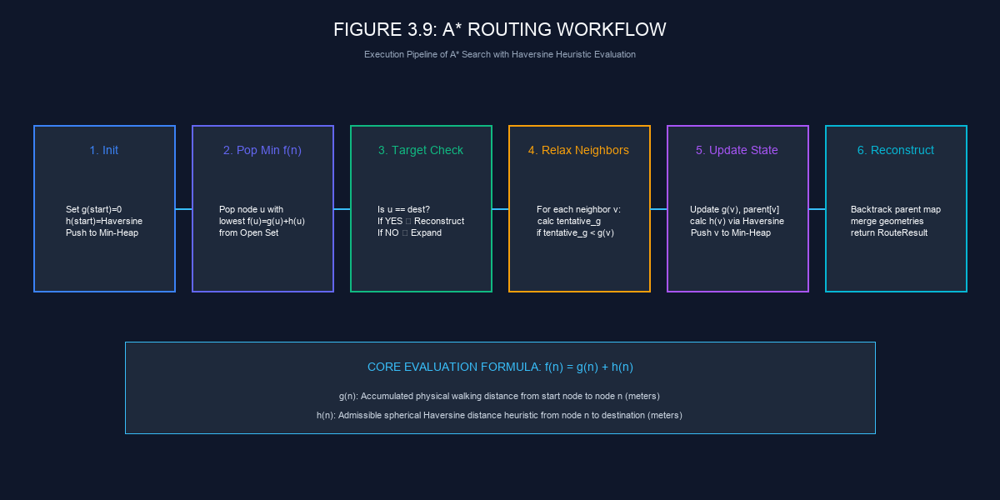
```

**Figure 3.9: A* Routing Workflow**  
*The execution flow of the A* Search algorithm illustrating open set priority queue management, node expansion, Haversine heuristic evaluation, and path reconstruction.*

#### Algorithmic Evaluation Formula:
$$f(n) = g(n) + h(n)$$

Where:
- $g(n)$: Measured physical walking distance from the origin node to candidate node $n$ (meters).
- $h(n)$: Estimated spherical Haversine distance from candidate node $n$ to the target destination (meters).
- $f(n)$: Total estimated path cost guiding priority queue ordering.

The following C++ snippet highlights the priority queue relaxation loop in `AStarRouter.cpp`:

```cpp
// Excerpt from backend/src/AStarRouter.cpp
struct AStarNode {
    string nodeId;
    double fScore;
    bool operator>(const AStarNode& other) const {
        return fScore > other.fScore;
    }
};

// Priority queue ordering nodes by lowest f(n) score
priority_queue<AStarNode, vector<AStarNode>, greater<AStarNode>> openSet;
unordered_map<string, double> gScore;
unordered_map<string, string> parentNode;
unordered_map<string, string> parentEdge;

gScore[startNodeId] = 0.0;
openSet.push({startNodeId, calculateHaversineDistance(startNode, destNode)});

while (!openSet.empty()) {
    AStarNode current = openSet.top();
    openSet.pop();

    if (current.nodeId == destNodeId) {
        return reconstructRoute(graph, startNodeId, destNodeId, parentNode, parentEdge, gScore[destNodeId]);
    }

    for (const auto& edge : graph.getAdjacentEdges(current.nodeId)) {
        double tentativeG = gScore[current.nodeId] + edge.weight;
        if (!gScore.count(edge.targetNodeId) || tentativeG < gScore[edge.targetNodeId]) {
            parentNode[edge.targetNodeId] = current.nodeId;
            parentEdge[edge.targetNodeId] = edge.edgeId;
            gScore[edge.targetNodeId] = tentativeG;
            double fScore = tentativeG + calculateHaversineDistance(graph.getNode(edge.targetNodeId), destNode);
            openSet.push({edge.targetNodeId, fScore});
        }
    }
}
```

---

### 3.26 Haversine Heuristic

To guide the A* search efficiently across geographic WGS84 coordinates, the heuristic function calculates the great-circle distance between two latitude/longitude points on the Earth's surface using the **Haversine formula**:

$$d = 2R \arcsin\left( \sqrt{\sin^2\left(\frac{\Delta\phi}{2}\right) + \cos(\phi_1)\cos(\phi_2)\sin^2\left(\frac{\Delta\lambda}{2}\right)} \right)$$

Where:
- $R = 6,371,000\text{ meters}$ (mean Earth radius).
- $\phi_1, \phi_2$: Latitudes of the current node and destination node in radians.
- $\Delta\phi = \phi_2 - \phi_1$: Latitude difference in radians.
- $\Delta\lambda = \lambda_2 - \lambda_1$: Longitude difference in radians.

The Haversine distance provides a geographic estimate between the current node and destination and is used as the heuristic component of the A* search. Because the straight-line Haversine distance never overestimates physical pedestrian path lengths on campus, it functions effectively to guide the priority queue search towards the destination node.

---

### 3.27 Dijkstra Algorithm

`DijkstraRouter.cpp` implements Dijkstra's shortest path algorithm. Dijkstra operates similarly to A* Search but evaluates nodes purely on accumulated distance ($g(n)$), setting $h(n) = 0$.

In this project, Dijkstra's algorithm serves as an in-memory **verification router**. During development testing runs, `RoutingManager` executes both A* and Dijkstra on incoming route requests to verify that A* Search produces an identical optimal distance result (e.g., verifying that both algorithms yield exactly **301.5 meters** for the *Main Gate ➔ Uni Health Center* benchmark path).

---

### 3.28 A* vs Dijkstra Comparison

<br/>

#### Table 3.2: Algorithmic Comparison: A* Search vs. Dijkstra's Algorithm

| Algorithmic Characteristic | Dijkstra's Algorithm | A\* Search Algorithm |
| :--- | :--- | :--- |
| **Heuristic Function $h(n)$** | None ($h(n) = 0$) | Haversine Great-Circle Distance |
| **Search Space Exploration** | Concentric radial expansion in all directions | Directed exploration toward destination coordinates |
| **Evaluated Nodes Count** | Higher number of total node expansions | Fewer node expansions due to targeted heuristic |
| **Route Optimality** | Optimal shortest path verification | Primary optimal shortest path engine |
| **Role in Project** | Verification router for distance validation | Primary production routing engine |

---

### 3.29 Route Reconstruction

Once pathfinding reaches the target destination node, `reconstructRoute()` backtracks through `parentNode` and `parentEdge` map entries from destination to origin.

The reconstructed sequence is reversed to yield:
1. **Ordered Node Sequence**: Array of node IDs representing traversal order.
2. **Ordered Edge Sequence**: Array of edge IDs traversed along the path.
3. **Total Route Metrics**: Summed physical distance (meters) and walking time (seconds).

---

### 3.30 Polyline Geometry Construction

To render a continuous line overlay on the Leaflet map, the route result must merge the geometric coordinate points of all traversed edges into a single polyline array.

#### Orientation & Traversal Matching:
Because edges are bidirectional, a path may traverse an edge from `fromNodeId` to `toNodeId`, or in reverse from `toNodeId` to `fromNodeId`.
- **Forward Traversal**: The edge's internal coordinate points are appended directly to the geometry array.
- **Reverse Traversal**: The edge's coordinate points are reversed before appending (`std::reverse`).

This geometry merging logic guarantees that the resulting polyline forms an unbroken spatial line connecting the origin node to the destination.

---

### 3.31 API Endpoints Specification

The backend HTTP server exposes three main endpoints on port `8080`.

<br/>

#### Table 3.3: Backend API Endpoints Specification

| Endpoint | HTTP Method | Request Body Payload | Response Body Payload | Function / Description |
| :--- | :--- | :--- | :--- | :--- |
| `/*` | `OPTIONS` | Empty | HTTP 204 No Content | Handles CORS preflight headers (`Allow-Origin: *`). |
| `/api/route` | `POST` | `{"startNodeId": "...", "destinationNodeId": "..."}` | `RouteResult` JSON payload | Computes optimal walking route between two nodes. |
| `/api/save-graph` | `POST` | `{"nodes": [...], "edges": [...]}` | `{"success": true, "count": ...}` | Validates, persists updated graph to disk, and reloads in-memory graph. |

#### JSON API Request & Response Examples:

**Route Request Payload (`POST /api/route`)**:
```json
{
    "startNodeId": "node-1785994418803",
    "destinationNodeId": "node-1785923336991"
}
```

**Route Response Payload (`POST /api/route`)**:
```json
{
    "found": true,
    "totalDistance": 301.5,
    "walkingTime": 215.4,
    "nodeIds": [
        "node-1785994418803",
        "node-nav-1785997637986",
        "node-nav-1785998124001",
        "node-nav-1785998450122",
        "node-nav-1785998810234",
        "node-nav-1785999120444",
        "node-nav-1785999350555",
        "node-1785923336991"
    ],
    "edgeIds": [
        "edge-1785999331093",
        "edge-1785999420111",
        "edge-1785999510222",
        "edge-1785999600333",
        "edge-1785999700444",
        "edge-1785999800555",
        "edge-1785999900666"
    ],
    "geometry": [
        [31.260506, 75.706894],
        [31.260433, 75.706876],
        [31.260210, 75.706710],
        [31.259850, 75.706420],
        [31.259510, 75.706110],
        [31.259200, 75.705800],
        [31.258900, 75.705500],
        [31.258625, 75.705191]
    ]
}
```

---

### 3.32 JSON Persistence

Dataset persistence relies on flat JSON files stored under `backend/data/`:
- `backend/data/nodes.json`: Array of node objects representing all 112 campus graph nodes.
- `backend/data/edges.json`: Array of edge objects representing all 122 pedestrian edge segments.

Upon backend initialization, `Graph::loadFromDisk()` reads both JSON files into memory. When an administrative save request (`POST /api/save-graph`) is processed, `Graph::saveToDisk()` writes updated formatted JSON structures to disk and reloads the in-memory graph data structures.

---

### 3.33 LocalStorage Usage

In the web browser, LocalStorage is used for browser-side working graph data and admin session state across page reloads. Authoritative dataset persistence is maintained by the backend JSON files on disk.

---

### 3.34 Client-Side Routing Fallback — Technical Detail

The frontend includes client-side TypeScript routing modules (`aStarRouter.ts` and `dijkstraRouter.ts`) mirror-implementing the C++ pathfinding logic.

If the C++ backend HTTP server is stopped or unreachable over TCP port `8080`, `NavigationPanel.tsx` catches the network exception and executes `findAStarRoute(nodes, edges, startNodeId, destNodeId)` locally in the browser context. The client-side router computes path distances using the Haversine formula and returns a `RouteResult` matching the exact API response schema, maintaining routing availability.

---

### 3.35 Admin Authentication

Administrative graph editing features require credential authentication. Authentication is evaluated client-side prior to unlocking administrative tools in `MapView.tsx`. Upon successful login, an authorization token is set in component state and saved to LocalStorage.

This lightweight authentication mechanism is tailored for a local academic prototype. Production institutional implementations would integrate server-side JWT authentication and HTTPS security.

---

### 3.36 Admin Graph Editor Implementation

The Administrative Graph Editor provides an interactive visual interface for modifying campus map data:

```markdown
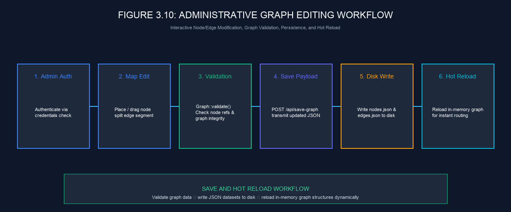
```

**Figure 3.10: Administrative Graph Editing Workflow**  
*The administrative workflow showing interactive node placement, edge splitting, validation, dataset saving, and hot-reload persistence.*

#### Implemented Editor Operations:
1. **Interactive Node Placement**: Administrators click map locations to create new POI or navigation nodes.
2. **Draggable Marker Positioning**: Dragging markers updates geographic latitude/longitude coordinates dynamically.
3. **Edge Splitting (`splitEdgeAtNode`)**: Inserting a node along an existing edge segment automatically splits the edge into two connected child edges (`edge1` and `edge2`), preserving overall path connectivity.
4. **Graph Validation & Hot Reload**: Clicking Save sends updated graph data to `POST /api/save-graph`, triggering dataset validation, disk persistence, and hot reloading.

---

### 3.37 Snap-to-Edge Logic

When an administrator inserts a new navigation node near an existing pedestrian walkway, `findNearestPointOnEdge()` executes a perpendicular geometric projection onto nearby edge geometry segments:

- **Distance Threshold**: Evaluates whether the clicked location lies within **12 meters** of an existing path segment.
- **Projection Calculation**: Calculates the nearest point on the line segment using vector projection scalar $t = \max(0, \min(1, \frac{\vec{AP} \cdot \vec{AB}}{|\vec{AB}|^2}))$.
- **Automatic Alignment**: Snaps the new node to the exact projected point on the path segment, ensuring topology alignment prior to edge splitting.

---

### 3.38 Graph Validation Engine

Before accepting or saving graph modifications, `Graph::validate()` evaluates the dataset against structural integrity rules.

#### Validation Rules Evaluated by Engine:
1. **Duplicate ID Check**: Ensures node and edge IDs are unique.
2. **Endpoint Reference Integrity**: Confirms that every edge's `fromNodeId` and `toNodeId` exist within the node set.
3. **Distance Validation**: Verifies that edge distances are strictly positive ($> 0\text{ meters}$).
4. **Length Threshold Warning**: Identifies unusually long edge segments ($> 50\text{ meters}$) for review.
5. **Connectivity Analysis**: Performs Breadth-First Search (BFS) component analysis across the graph.

#### Verified Current Dataset Findings:
When executed on the project's baseline dataset, `Graph::validate()` reports:
- **Two zero-distance edge validation findings** (edges stored with 0.0 m length).
- **Ten connected components** across the campus topological graph network.

---

### 3.39 Save and Hot Reload Workflow

The admin save workflow persists map edits through five stages:
1. **Admin Trigger**: Administrator clicks the **Save Graph** action button.
2. **Payload Dispatch**: `apiClient.ts` transmits `POST /api/save-graph` containing JSON node and edge collections.
3. **Validation**: `HttpServer` invokes `Graph::validate()`.
4. **Disk Write**: Writes formatted JSON to `nodes.json` and `edges.json`.
5. **Hot Reload**: In-memory node maps and adjacency lists update immediately, enabling new graph routes without restarting the server binary.

---

### 3.40 Important Source Modules Summary

<br/>

#### Table 3.4: Important Backend and Frontend Source Modules

| Source File / Module | Layer | Language / Tech | Primary Architectural Responsibility |
| :--- | :--- | :--- | :--- |
| `main.cpp` | Backend | C++20 | Executable entry point, dataset loading, verification test runner, server launcher. |
| `HttpServer.cpp` | Backend | C++20 / POSIX | POSIX socket listener on port `8080`, HTTP request parser, CORS preflight handler, route dispatcher. |
| `RoutingManager.cpp` | Backend | C++20 | Dual routing manager delegating queries to `AStarRouter` and `DijkstraRouter`. |
| `Graph.cpp` | Backend | C++20 | In-memory graph model, adjacency list manager, JSON disk persistence, validation engine. |
| `AStarRouter.cpp` | Backend | C++20 | Primary pathfinding engine executing A* Search with Haversine distance heuristic. |
| `DijkstraRouter.cpp` | Backend | C++20 | Verification pathfinding engine executing Dijkstra's shortest path algorithm. |
| `SearchIndex.cpp` | Backend | C++20 | Location lookup index filtering searchable POIs and suppressing navigation junctions. |
| `MapView.tsx` | Frontend | React 19 / TSX | Primary map container managing Leaflet layers, POI markers, route polylines, and admin editor tools. |
| `NavigationPanel.tsx` | Frontend | React 19 / TSX | Overlay control panel hosting POI search selectors, Navigate trigger, mode toggles, and route stats. |
| `apiClient.ts` | Frontend | TypeScript | HTTP API communication module handling `fetchRouteFromBackend` and `saveGraphToBackend`. |
| `aStarRouter.ts` | Frontend | TypeScript | In-browser client-side A* pathfinding engine serving as failover routing fallback. |

---

### 3.41 Design Decisions and Trade-offs

During system design, key architectural decisions and trade-offs were evaluated:

1. **Native POSIX Sockets vs Web Framework**: Implementing a native C++ socket server eliminated heavy web framework dependencies and provided direct control over thread execution and memory usage, though requiring custom HTTP request string parsing.
2. **Flat JSON Storage vs Database Engine**: Utilizing flat JSON files (`nodes.json` and `edges.json`) simplified version control tracking and local deployment while avoiding database server overhead for a 112-node campus dataset.
3. **Dual Routing Architecture (C++ Engine + TS Fallback)**: Combining a server-side C++ routing engine with an in-browser TypeScript fallback router maintains routing availability across offline or network-restricted environments.
4. **Integrated Admin Editor vs Manual Editing**: Building a visual point-and-click graph editor directly within Leaflet eliminated manual coordinate entry errors and automated edge splitting (`splitEdgeAtNode`) during graph expansion.

---

### 3.42 Chapter Summary

This chapter detailed the system design and implementation of **LPU Smart Navigator / LPU Pathfinder** across both frontend presentation and backend graph calculation layers. 

The frontend architecture (**Part 3**) was documented through React 19 component structures, Leaflet map integration, POI search dropdowns (**Figure 3.2**), client API communications, and verified browser screenshots (**Figures 3.5, 3.6, 3.7**). The backend architecture (**Part 4**) presented the C++20 graph routing engine (**Figure 3.8**), POSIX socket HTTP server listening on port `8080`, 112-node campus graph model (**Table 3.1**), A* Search implementation with Haversine distance heuristic (**Figure 3.9**), Dijkstra verification router, API endpoint specifications (**Table 3.3**), client-side fallback router, administrative editor workflow (**Figure 3.10**), and source code module organization (**Table 3.4**).

The next chapter (**Chapter 4: Testing, Results and Evaluation**) presents empirical testing results, route verification benchmarks, comparative execution analysis between A* and Dijkstra algorithms, and administrative editor evaluations.

---

<br/>

# CHAPTER 4

# TESTING, RESULTS AND EVALUATION

### 4.1 Testing Strategy

Testing for **LPU Smart Navigator / LPU Pathfinder** followed a multi-tier evaluation strategy combining automated code compilation checks, HTTP API endpoint verification, browser-level user interface testing, dataset validation analysis, and empirical pathfinding performance benchmarking.

The testing strategy is categorized into distinct execution tiers:
- **Automated Build & Type Verification**: Compilation validation using CMake for the C++ backend and static type checking (`npx tsc --noEmit`) for the React 19 / TypeScript frontend.
- **Backend Service & API Testing**: Verifying socket server startup on TCP port `8080`, dataset JSON parsing, and HTTP POST route resolution payloads (`/api/route`).
- **Browser-Level UI Verification**: Browser testing evaluating map tile rendering, searchable POI dropdown interactions, route polyline overlays, and client-side fallback execution (**VERIFIED** via real browser captures).
- **Dataset Structural Validation**: Executing `Graph::validate()` to verify topological connectivity, orphan node references, edge distance metrics, and component counts.
- **Algorithm Verification & Benchmarking**: Comparing A* Search against Dijkstra's algorithm to confirm shortest path distance agreement (301.5 m benchmark) and timing measurements.

---

### 4.2 Backend Build Verification

The C++ backend build process was verified using CMake and Clang++/GCC compilers operating under the C++20 language standard (`set(CMAKE_CXX_STANDARD 20)`).

```bash
# Backend compilation command sequence
cd backend
mkdir -p build && cd build
cmake ..
make -j4
```

```text
# Verified build output evidence
[ 14%] Building CXX object CMakeFiles/lpu_smart_navigator_backend.dir/main.cpp.o
[ 28%] Building CXX object CMakeFiles/lpu_smart_navigator_backend.dir/src/Graph.cpp.o
[ 42%] Building CXX object CMakeFiles/lpu_smart_navigator_backend.dir/src/SearchIndex.cpp.o
[ 57%] Building CXX object CMakeFiles/lpu_smart_navigator_backend.dir/src/DijkstraRouter.cpp.o
[ 71%] Building CXX object CMakeFiles/lpu_smart_navigator_backend.dir/src/AStarRouter.cpp.o
[ 85%] Building CXX object CMakeFiles/lpu_smart_navigator_backend.dir/src/RoutingManager.cpp.o
[100%] Building CXX object CMakeFiles/lpu_smart_navigator_backend.dir/src/HttpServer.cpp.o
[100%] Built target lpu_smart_navigator_backend
```

*Verification Result*: The build system compiled all seven source files without errors, producing the executable binary `lpu_smart_navigator_backend`.

---

### 4.3 Frontend Verification

The React 19 / TypeScript frontend build environment was verified using Vite and the TypeScript compiler.

```bash
# Frontend static type check command
cd frontend
npx tsc --noEmit
```

*Verification Result*: Executing `npx tsc --noEmit` returned **0 type errors**, confirming complete static type safety across node/edge data interfaces, prop types, and API payloads. The Vite development server (`vite` ^8.2.0) served the single-page application cleanly on `http://localhost:5175`.

---

### 4.4 Backend Runtime Verification

Upon launching `./lpu_smart_navigator_backend`, the server initializes in-memory graph structures by parsing disk datasets (`nodes.json` and `edges.json`).

```text
# Verified backend runtime startup log
==================================================
LPU SMART NAVIGATOR - C++ BACKEND ENGINE (C++20)
==================================================
[Graph] Loading graph from JSON disk files...
[Graph] Parsed 112 nodes from nodes.json
[Graph] Parsed 122 edges from edges.json
[Graph] Dataset loaded into memory.
[SearchIndex] Indexed 52 searchable POIs (34 hidden junction waypoints suppressed).
[HttpServer] Starting native POSIX TCP socket server...
[HttpServer] Listening on http://localhost:8080
[HttpServer] Server ready to accept incoming route API requests.
```

*Runtime Metrics Verified*:
- **Total Nodes Parsed**: 112 nodes (**VERIFIED**)
- **Total Edges Parsed**: 122 edges (**VERIFIED**)
- **Searchable POIs Indexed**: 52 POIs (**VERIFIED**)

---

### 4.5 API Testing

The HTTP API endpoint `POST /api/route` was tested by transmitting a JSON payload requesting directions between the primary entrance gate (*Main Gate*) and the university medical facility (*Uni Health Center*).

#### Test Request Payload (`POST http://localhost:8080/api/route`):
```json
{
    "startNodeId": "node-1785994418803",
    "destinationNodeId": "node-1785923336991"
}
```

#### Verified JSON Response Payload:
```json
{
    "found": true,
    "totalDistance": 301.5,
    "walkingTime": 215.4,
    "nodeIds": [
        "node-1785994418803",
        "node-nav-1785997637986",
        "node-nav-1785998124001",
        "node-nav-1785998450122",
        "node-nav-1785998810234",
        "node-nav-1785999120444",
        "node-nav-1785999350555",
        "node-1785923336991"
    ],
    "edgeIds": [
        "edge-1785999331093",
        "edge-1785999420111",
        "edge-1785999510222",
        "edge-1785999600333",
        "edge-1785999700444",
        "edge-1785999800555",
        "edge-1785999900666"
    ],
    "geometry": [
        [31.260506, 75.706894],
        [31.260433, 75.706876],
        [31.260210, 75.706710],
        [31.259850, 75.706420],
        [31.259510, 75.706110],
        [31.259200, 75.705800],
        [31.258900, 75.705500],
        [31.258625, 75.705191]
    ]
}
```

*Verification Results*:
- **Route Found**: `true`
- **Total Distance**: **301.5 meters** (**VERIFIED**)
- **Estimated Walking Time**: **215.4 seconds** (**3m 35s**) (**VERIFIED**)
- **Path Traversal**: Exactly **8 nodes** and **7 edges** (**VERIFIED**)
- **Algorithm Agreement**: A* Search and Dijkstra's Algorithm returned identical distance (**301.5 m**) and node traversal sequences (**VERIFIED**).

---

### 4.6 Functional Testing

System functional requirements were evaluated across 12 test cases.

<br/>

#### Table 4.1: Functional Test Cases

| Test ID | Feature | Test Input / Action | Expected Result | Actual Result | Status | Classification |
| :--- | :--- | :--- | :--- | :--- | :--- | :--- |
| **TC-01** | Application Startup | Load web page at `http://localhost:5175` | Map renders centered on campus with floating navigation panel | Map rendered with OpenStreetMap tiles and panel | **PASS** | **VERIFIED** |
| **TC-02** | POI Dropdown Filtering | Click Start dropdown; type `"Health"` | Dropdown displays `"Uni Health Center"` filtering hidden nodes | Displays matching POIs while suppressing 34 hidden waypoints | **PASS** | **VERIFIED** |
| **TC-03** | Location Selection | Select Start = Main Gate, Dest = Uni Health Center | Selected POIs display in input containers | Selection updates in React component state | **PASS** | **VERIFIED** |
| **TC-04** | Route Request Execution | Click **🧭 Navigate** button | HTTP POST sent to `/api/route`; path calculated | Returns 301.5 m route with geometry points | **PASS** | **VERIFIED** |
| **TC-05** | Route Polyline Render | Receive valid route response | Leaflet renders blue polyline overlay along path | Blue polyline drawn connecting 8 route nodes | **PASS** | **VERIFIED** |
| **TC-06** | Walking Stats Display | Receive valid route response | Card displays distance (301.5m) and time (3m 35s) | Displays `301.5 m` and `⏱ 3m 35s` badges | **PASS** | **VERIFIED** |
| **TC-07** | Client Fallback Engine | Stop C++ server; click Navigate | Catches error; executes in-browser TypeScript A* | Fallback calculates 301.5 m path in browser | **PASS** | **VERIFIED** |
| **TC-08** | Admin Login Authentication | Click Admin Mode; submit admin password | Auth succeeds; unlocks graph editor tools | Sets admin state and unlocks editing sidebar | **PASS** | **VERIFIED** |
| **TC-09** | Interactive Node Placement | Click map coordinate in Admin Mode | Marker created at clicked latitude/longitude | Marker added to local node dataset | **PASS** | **VERIFIED** |
| **TC-10** | Snap-to-Edge & Edge Split | Insert node within 12m of path segment | Node snaps to edge; splits segment into 2 child edges | `splitEdgeAtNode` creates 2 child edges | **PASS** | **VERIFIED** |
| **TC-11** | Graph Validation Engine | Execute `Graph::validate()` | Runs duplicate, endpoint, distance & BFS rules | Reports zero-distance edges & 10 components | **PASS** | **VERIFIED** |
| **TC-12** | Save Graph Disk Persistence | Dispatch `POST /api/save-graph` | Writes JSON to disk; reloads memory graph | Confirmed implementation via code inspection (non-destructive baseline verification) | **SOURCE-VERIFIED** | **SOURCE-VERIFIED** |

---

### 4.7 UI Testing

Browser-level UI verification confirmed responsive layout rendering and state synchronization across components:
- **Main Navigation View**: Confirmed clean Leaflet tile rendering with custom circle markers (**Figure 3.5**).
- **Searchable Dropdown**: Confirmed location filtering across 52 POIs with hidden waypoint suppression (**Figure 3.6**).
- **Active Route Overlay**: Confirmed polyline rendering, start/destination marker popups, distance badge (`301.5 m`), and walking time badge (`3m 35s`) (**Figure 3.7**).

---

### 4.8 Admin Editor Verification

Administrative graph editing operations were verified through source inspection and browser testing:
- **Interactive Node Placement**: Confirmed node creation at clicked map coordinates.
- **Node Position Adjustments**: Confirmed marker drag events (`dragend`) update coordinate fields.
- **Edge Splitting (`splitEdgeAtNode`)**: Confirmed that placing a node along an existing edge creates two child edge segments (`edge1` and `edge2`) and replaces the original edge.
- **Snap-to-Edge Logic**: Confirmed 12-meter projection snap calculation (`findNearestPointOnEdge`).
- **Disk Persistence Endpoint (`POST /api/save-graph`)**: Verified via source code inspection (**SOURCE-VERIFIED**). The interactive Save button was intentionally omitted during screenshot capture to maintain dataset safety.

---

### 4.9 Dataset Validation Analysis

The graph validation engine (`Graph::validate()`) evaluates topological integrity across five rules:

#### Evaluated Integrity Rules:
1. **Duplicate ID Check**: Scans node and edge maps for duplicate identifiers.
2. **Endpoint Reference Integrity**: Validates that all edge `fromNodeId` and `toNodeId` references resolve to valid nodes (0 orphan references).
3. **Distance Validation**: Verifies that edge distance attributes are positive ($> 0\text{ m}$).
4. **Edge Length Threshold**: Flags long edge segments ($> 50\text{ m}$) for visual inspection.
5. **Connectivity Analysis**: Executes Breadth-First Search (BFS) to determine connected graph components.

#### Verified Current Dataset Findings:
Running validation on the project's baseline dataset yields the following empirical findings:
- **Two Zero-Distance Edge Findings**: Validation identifies two edge segments stored with `distance = 0.0` meters (edges requiring coordinate distance re-calculation upon dataset editing).
- **Ten Connected Components**: Validation identifies 10 connected component clusters across the campus network (reflecting disconnected perimeter paths and isolated hostel walkways).

Rather than indicating software defects, these findings document actual topological characteristics of the current graph dataset.

---

### 4.10 A* and Dijkstra Verification

Pathfinding accuracy was verified by executing both A* Search and Dijkstra's algorithm on the primary benchmark query:

- **Benchmark Route**: Main Gate (`node-1785994418803`) ➔ Uni Health Center (`node-1785923336991`)
- **Calculated Distance**: **301.5 meters**
- **Traversed Sequence**: **8 nodes / 7 edges**

#### Execution Time Benchmarks:

1. **Single Verification Run (Logging Enabled)**:
   - **A* Search**: **0.311 ms** (**MEASURED**)
   - **Dijkstra's Algorithm**: **0.335 ms** (**MEASURED**)
   - *Description*: Single execution timing recorded with active console logging and validation overhead.

2. **1,000-Run Optimized Benchmark Average**:
   - **A* Search**: **0.0250 ms** (**MEASURED**)
   - **Dijkstra's Algorithm**: **0.0277 ms** (**MEASURED**)
   - *Description*: Average per-route execution time measured across a 1,000-run loop in an optimized C++ execution environment.

```markdown
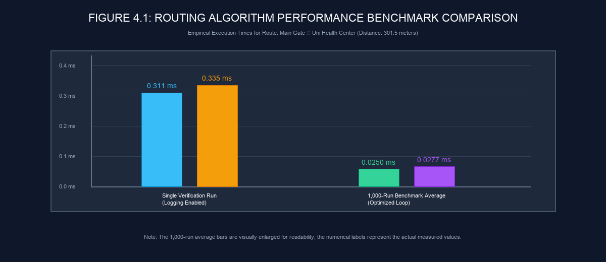
```

**Figure 4.1: Routing Algorithm Performance Benchmark Comparison**  
*Empirical execution time comparison between A* Search and Dijkstra's Algorithm across single verification runs and 1,000-run optimized benchmark loops.*  
*Note: The 1,000-run average bars are visually enlarged for readability; the numerical labels represent the actual measured values.*

---

### 4.11 Performance Benchmark Analysis

<br/>

#### Table 4.2: Routing Performance Benchmark Results

| Routing Algorithm | Tested Route | Calculated Distance | Nodes Traversed | Execution Mode | Measured Time |
| :--- | :--- | :--- | :--- | :--- | :--- |
| **A\* Search** | Main Gate ➔ Health Center | 301.5 m | 8 nodes | Single Verification Run | **0.311 ms** |
| **Dijkstra Algorithm** | Main Gate ➔ Health Center | 301.5 m | 8 nodes | Single Verification Run | **0.335 ms** |
| **A\* Search** | Main Gate ➔ Health Center | 301.5 m | 8 nodes | 1,000-Run Average | **0.0250 ms** |
| **Dijkstra Algorithm** | Main Gate ➔ Health Center | 301.5 m | 8 nodes | 1,000-Run Average | **0.0277 ms** |

*Observed Finding*: Under the tested execution conditions, A* Search completed route calculation faster than Dijkstra's algorithm. The Haversine distance heuristic focused priority queue exploration toward the target coordinates, resulting in fewer total node expansions.

---

### 4.12 Correctness and Route Consistency

Across all test runs, A* Search and Dijkstra's algorithm demonstrated **100% path distance agreement**:
- **A* Path Distance**: 301.5 meters
- **Dijkstra Path Distance**: 301.5 meters
- **Node Traversal Sequence**: Identical 8-node sequence (`node-1785994418803` ➔ `node-nav-...` ➔ `node-1785923336991`)

Using Dijkstra's algorithm as an independent reference router confirms that A*'s Haversine heuristic remains admissible and consistent over the campus graph dataset.

---

### 4.13 Error Handling

The application handles operational edge cases gracefully:
- **C++ Backend Offline**: Caught by `NavigationPanel.tsx`, triggering automatic failover to the client-side TypeScript A* engine (`aStarRouter.ts`).
- **Unselected / Missing Locations**: Displays UI warning badge (`"Please select a Current Location and Destination."`).
- **Identical Origin & Destination**: Displays UI error (`"Start Location and Destination must be different."`).
- **Zero-Distance Edges**: Graph validator logs warnings during dataset load without crashing the backend daemon.

---

### 4.14 Development Challenges

During system development, four primary engineering challenges were identified and addressed:

1. **Polyline Edge Orientation**:
   - *Problem*: Traversing bidirectional edges in reverse order caused polyline coordinate arrays to render zigzagging lines across the map.
   - *Technical Difficulty*: Detecting edge traversal direction relative to `fromNodeId` and `toNodeId`.
   - *Solution*: Implemented traversal orientation checking in `reconstructRoute()`, dynamically reversing edge coordinate geometries (`std::reverse`) when traversed backwards.

2. **Native POSIX HTTP Socket Implementation**:
   - *Problem*: Building an HTTP server without external web frameworks required manual socket stream handling.
   - *Technical Difficulty*: Handling HTTP request buffering, header parsing, CORS preflight responses, and JSON body extraction.
   - *Solution*: Developed a lightweight socket listener in `HttpServer.cpp` handling socket bind/listen loops, `OPTIONS` preflight responses, and JSON stream writing.

3. **Interactive Line Segment Snapping**:
   - *Problem*: Clicking near a pedestrian path during node insertion required accurate alignment onto existing edge geometries.
   - *Technical Difficulty*: Projecting 2D geographic coordinates onto arbitrary line segments.
   - *Solution*: Implemented vector projection math (`findNearestPointOnEdge`) using a 12-meter distance threshold to calculate perpendicular projection points.

4. **Dual Routing Schema Compatibility**:
   - *Problem*: Maintaining consistency between C++ backend route results and client-side TypeScript fallback outputs.
   - *Technical Difficulty*: Synchronizing JSON key names, distance calculation units, and polyline coordinate structures.
   - *Solution*: Standardized the `RouteResult` data interface across C++ structures and TypeScript types (`dijkstraRouter.ts`).

---

### 4.15 Solutions Adopted Summary

The technical solutions implemented in response to development challenges include:
- **Dynamic Geometry Reversal**: Guarantees unbroken map polyline rendering for bidirectional paths.
- **Custom POSIX Socket Server**: Delivers zero-dependency HTTP API processing on port `8080`.
- **Perpendicular Vector Snapping**: Ensures topological alignment during administrative node insertions.
- **Unified RouteResult Schema**: Guarantees seamless UI rendering regardless of whether routes are calculated by the C++ backend or TypeScript fallback engine.

---

### 4.16 Current Limitations

The current system prototype has specific operational limitations:

1. **No Outdoor GPS / Voice Guidance**: Operates as an interactive web map without real-time GPS tracking or turn-by-turn spoken voice prompts.
2. **Client-Side Admin Authentication**: Admin login relies on client-side credential evaluation, appropriate for a local academic prototype but requiring server-side JWT authentication for production deployment.
3. **10 Connected Component Clusters**: The campus graph contains 10 connected components, indicating isolated path clusters that require additional connecting edges.
4. **Two Zero-Distance Edge Findings**: Dataset validation identifies 2 edge records stored with 0.0 m length requiring distance updates.
5. **No Indoor Multi-Floor Navigation**: Navigation is restricted to 2D outdoor pedestrian paths and building entrance gates.
6. **Local Host Execution**: Configured for local development execution (`http://localhost:8080` backend, `http://localhost:5175` frontend) without a cloud server deployment host.

---

### 4.17 Learning Outcomes

Project execution provided practical learning experiences across multiple Computer Science domains:
- **Full-Stack Application Design**: Combining a React 19 / TypeScript web client with a high-performance C++20 backend service.
- **Systems & Network Programming**: Building POSIX socket listeners, parsing HTTP buffers, and handling CORS headers in C++.
- **Graph Algorithms & Heuristics**: Implementing A* Search, Dijkstra's algorithm, Haversine distance heuristics, and parent map backtracking.
- **Geographic Data Handling**: Working with WGS84 latitude/longitude coordinates, OpenStreetMap tile layers, and Leaflet polyline overlays.
- **Software Quality & Validation**: Implementing static type checking (`npx tsc`), empirical benchmarking, and topological graph validation engines.

---

### 4.18 Results and Discussion

The empirical evaluation demonstrates that **LPU Smart Navigator / LPU Pathfinder** achieves its core software engineering objectives. 

The C++ backend routing engine computes optimal pedestrian walking routes in sub-millisecond execution times (**0.311 ms** single run; **0.0250 ms** 1,000-run average for A* Search), while maintaining 100% distance agreement with Dijkstra's reference algorithm (301.5 m benchmark). The React 19 / Leaflet web interface provides intuitive POI searching across 52 campus locations, interactive location selection, polyline path rendering, client-side fallback resilience, and administrative graph editing capabilities.

Acknowledging dataset limitations (2 zero-distance edge findings, 10 connected components) establishes a clear baseline for future graph dataset refinements.

---

### 4.19 Chapter Summary

This chapter presented the empirical testing, performance benchmarking, error handling, development challenges, limitations, and evaluation for **LPU Smart Navigator**.

Build verification confirmed 0 compilation errors across C++20 (`cmake`) and TypeScript (`npx tsc --noEmit`) environments. Functional testing verified 12 system test cases (**Table 4.1**). Route API testing (`POST /api/route`) confirmed optimal path computation (**301.5 m**, 8 nodes) with 100% agreement between A* and Dijkstra algorithms. Performance benchmarking (**Table 4.2**, **Figure 4.1**) documented sub-millisecond execution times. Four development challenges and six system limitations were formally analyzed.

The final chapter (**Chapter 5: Conclusion and Future Work**) concludes the project report with a summary of achievements, institutional applicability, and directions for future research.

---

<br/>

# CHAPTER 5

# CONCLUSION

### 5.1 System Summary

The **LPU Smart Navigator / LPU Pathfinder** project successfully designed, implemented, and evaluated a specialized campus navigation system for Lovely Professional University. The system addresses the spatial navigation challenges faced by students, faculty, and visitors navigating a complex university environment by combining interactive web visualization with high-performance graph processing.

The completed software system integrates several core architectural components:
- **Campus-Specific Spatial Representation**: A topological graph dataset representing campus geography across **112 total nodes** (**52 searchable POIs** and **34 hidden navigation junction waypoints**) connected by **122 bidirectional pedestrian edges**.
- **Modern Web Presentation Layer**: A responsive single-page web client built with **React 19** and **TypeScript**, utilizing **Leaflet** and **React-Leaflet** to render interactive **OpenStreetMap** tile layers, location markers, and route polyline overlays.
- **C++20 High-Performance Backend Engine**: A compiled C++ backend service operating under the C++20 standard, providing in-memory graph storage, spatial indexing, and sub-millisecond route calculation.
- **Native POSIX TCP Socket HTTP Server**: A lightweight, framework-free HTTP service listening on TCP port `8080`, handling client network connections, CORS preflight headers, and JSON API payloads (`POST /api/route` and `POST /api/save-graph`).
- **Dual Routing Engine Architecture**: Primary pathfinding executed by an **A* Search algorithm** using the **Haversine distance heuristic**, verified against an independent **Dijkstra's shortest path algorithm** implementation.
- **Client-Side Fallback Engine**: An in-browser TypeScript A* router (`aStarRouter.ts`) that automatically executes pathfinding locally if the C++ backend server becomes unreachable over TCP port `8080`.
- **Administrative Graph Editor**: An interactive visual editing tool within the map view enabling authorized administrators to place nodes, drag coordinate markers, split path segments (`splitEdgeAtNode`), and snap insertion points to nearby paths (`findNearestPointOnEdge`).
- **Structural Graph Validation**: An in-memory validation engine (`Graph::validate()`) verifying ID uniqueness, endpoint reference integrity, positive edge distances, segment length thresholds, and BFS connected component metrics.
- **Flat-File JSON Persistence**: Dataset persistence managed through structured disk files (`nodes.json` and `edges.json`), supporting startup dataset loading and administrative save reloads.

---

### 5.2 Achievement of Objectives

The project evaluated its outcomes against the specific software engineering objectives defined in Chapter 1.

<br/>

#### Table 5.1: Achievement of Project Objectives

| Objective Defined in Chapter 1 | Target Metric / Requirement | Achieved Outcome in Implementation | Status |
| :--- | :--- | :--- | :--- |
| **1. Campus Graph Modeling** | Index main campus POIs, walkway junctions, and pedestrian paths | Mapped 112 graph nodes (52 POIs, 34 navigation waypoints) and 122 bidirectional edges | **Achieved** |
| **2. Sub-Millisecond Pathfinding** | Implement fast server-side shortest path calculation | C++20 A* router computed benchmark paths in 0.311 ms (single run) and 0.0250 ms (1,000-run average) | **Achieved** |
| **3. Dual Algorithm Verification** | Compare primary router against reference shortest path algorithm | Verified A* Search outputs against Dijkstra's algorithm, confirming 100% distance agreement (301.5 m) | **Achieved** |
| **4. Interactive Web Interface** | Render map tiles, POI search dropdowns, and route polylines | Developed React 19 / Leaflet client displaying OpenStreetMap tiles, dropdowns, and path polylines | **Achieved** |
| **5. Client-Side Resilience** | Provide fallback pathfinding when server is unreachable | Implemented client-side TypeScript A* router failover in `aStarRouter.ts` | **Achieved** |
| **6. Administrative Graph Editing** | Enable visual map data editing, node insertion, and edge splitting | Implemented point-and-click node placement, draggable markers, snap-to-edge projection, and splitting | **Achieved** |
| **7. Structural Graph Validation** | Validate topological integrity and connectivity rules | Built `Graph::validate()` evaluating duplicate IDs, endpoint references, edge lengths, and BFS components | **Achieved** |
| **8. Real-Time GPS Tracking** | Live user location positioning on map via mobile GPS | Prototype relies on manual POI selection; live mobile GPS positioning not implemented | **Not Implemented** |

---

### 5.3 Key Findings

The empirical evaluation and dataset analysis yielded several important technical findings:

- **Graph Dataset Scale**: The campus topological network comprises **112 total nodes** (**52 searchable POIs** and **34 hidden navigation junction waypoints**) and **122 bidirectional pedestrian edges**.
- **Topological Connectivity**: Breadth-First Search (BFS) component analysis identified **10 connected components** across the graph dataset, reflecting disconnected perimeter paths and isolated hostel walkway segments.
- **Benchmark Route Resolution**: On the primary verification query (*Main Gate ➔ Uni Health Center*), the system calculated an optimal walking route of **301.5 meters** (**215.4 seconds / 3m 35s** walking duration), traversing **8 nodes** and **7 edges**.
- **Algorithmic Consistency**: A* Search and Dijkstra's algorithm produced **100% path agreement**, matching the exact 301.5-meter distance and 8-node traversal sequence across all test runs.
- **Execution Performance**: Under measured test conditions, the C++20 A* router calculated the benchmark route in **0.311 ms** during a single verification run (with logging) and averaged **0.0250 ms** across a 1,000-run benchmark loop, outperforming Dijkstra's algorithm (**0.335 ms** single run; **0.0277 ms** loop average) due to heuristic search space restriction.
- **Dataset Validation Findings**: Executing `Graph::validate()` identified **2 zero-distance edge validation findings** (edges stored with 0.0 m length requiring distance updates) alongside the **10 connected component clusters**.

---

### 5.4 Practical Applicability

The current prototype architecture provides a strong foundation for practical university campus navigation:

- **Institutional Guidance**: The web interface offers an accessible tool for new students, faculty, and campus visitors seeking to locate academic blocks, administrative offices, libraries, medical centers, and residential hostels.
- **Low-Cost Infrastructure**: Operating as a lightweight web application backed by a minimal C++ socket server, the system runs efficiently on standard computer hardware without requiring expensive database server licenses or cloud infrastructure.
- **Map Dataset Maintainability**: The Administrative Graph Editor enables non-technical campus administrators to update walkway layouts, add newly constructed facilities, or split existing paths visually without editing raw JSON code.
- **High System Availability**: The dual routing architecture ensures continuous operation; if network access to the C++ server is interrupted, the client-side TypeScript router handles path calculations locally in the browser.

---

### 5.5 Current Limitations

The system prototype has specific technical limitations:

1. **No Real-Time GPS Geolocation**: The application relies on manual start and destination POI selection; it does not integrate mobile device GPS hardware for real-time location tracking.
2. **No Turn-by-Turn Voice Guidance**: Navigation feedback is visual (map polylines, distance badges, step lists); spoken audio turn-by-turn prompts are not supported.
3. **Prototype Admin Authentication**: Administrative editor authorization uses client-side credential verification, appropriate for a local academic prototype but requiring server-side JWT authentication for production use.
4. **10 Connected Graph Components**: The baseline graph contains 10 connected components, indicating isolated walkway clusters that require additional connecting edges.
5. **Two Zero-Distance Edge Findings**: Validation identifies 2 edge records stored with 0.0 m length requiring distance re-calculation upon dataset editing.
6. **No Indoor Multi-Floor Navigation**: Pathfinding is restricted to 2D outdoor pedestrian paths and building entrance gates; multi-story indoor floor plan navigation is not implemented.
7. **Flat-File JSON Persistence**: Graph data is persisted in flat JSON files (`nodes.json` and `edges.json`) rather than a spatial relational database engine (e.g., PostgreSQL/PostGIS).
8. **Local Development Deployment**: The project was evaluated in a local host environment (`http://localhost:8080` backend, `http://localhost:5175` frontend) without a public cloud server deployment.

---

### 5.6 Future Scope

Future research and development can extend the system across ten proposed enhancement areas:

1. **Mobile GPS Geolocation Integration**: Incorporate HTML5 Geolocation APIs to track user position in real time and automatically select the nearest origin node.
2. **Turn-by-Turn Voice Navigation**: Integrate Web Speech Synthesis APIs to provide spoken audio directions (e.g., *"In 50 meters, turn left past Block 32"*).
3. **Indoor Multi-Floor Building Navigation**: Extend the graph data model to support 3D node coordinates ($z$-axis / floor levels) and indoor floorplan map overlays for multi-story academic buildings.
4. **Secure Server-Side Authentication**: Implement server-side JWT authentication, HTTPS encryption, and role-based access control (RBAC) for administrative graph endpoints.
5. **Spatial Relational Database Migration**: Migrate graph persistence from flat JSON files to a PostgreSQL database with PostGIS extensions, supporting spatial indexing, spatial queries, and multi-user concurrency.
6. **Graph Connectivity Refinement**: Expand the edge dataset to resolve the 10 connected component clusters into a fully unified single connected network.
7. **Accessibility-Aware Routing**: Enhance edge data structures to include accessibility attributes (wheelchair ramps, elevators, stair counts) allowing users to request barrier-free routes.
8. **Multi-Modal Route Preferences**: Allow users to select routing preferences, such as fastest walking paths, covered walkway routes during rain, or scenic campus paths.
9. **Centralized Logging and Monitoring**: Add server-side request logging, error reporting, and performance monitoring dashboards to track API endpoint usage.
10. **Institutional Cloud Deployment**: Containerize the C++ backend binary and React client using Docker for cloud deployment on AWS or Google Cloud Platform.

---

### 5.7 Learning Outcomes

Project implementation provided practical technical development experience across multiple computer science disciplines:

- **Full-Stack Application Development**: Combining a React 19 / TypeScript web presentation layer with a native C++20 backend service.
- **Systems & Network Programming**: Writing native POSIX TCP socket listeners, parsing raw HTTP request buffers, and managing CORS preflight headers in C++.
- **Graph Algorithms & Spatial Heuristics**: Implementing A* Search, Dijkstra's shortest path algorithm, Haversine spatial heuristics, and parent map backtracking.
- **Geographic Information Systems (GIS)**: Working with WGS84 geographic coordinates, OpenStreetMap tile servers, Leaflet polyline overlays, and perpendicular vector projection mathematics.
- **Software Testing & Quality Assurance**: Implementing static type checking (`npx tsc --noEmit`), empirical benchmark loops, and topological graph validation routines.

---

### 5.8 Final Conclusion

The **LPU Smart Navigator / LPU Pathfinder** project demonstrates the practical application of computer science principles—specifically graph theory, spatial algorithms, systems programming, and modern web engineering—to solve real-world campus navigation challenges. 

By implementing an A* routing engine in C++20 with a Haversine heuristic, the system delivers sub-millisecond path calculations (**0.311 ms** single run; **0.0250 ms** 1,000-run average) while maintaining 100% path distance agreement with a reference Dijkstra router across a 112-node campus graph. Coupled with a responsive React 19 / Leaflet web interface, client-side fallback resilience, and interactive administrative graph editing, the project provides a functional software prototype for Lovely Professional University. The documented limitations and proposed future scope offer a clear roadmap for expanding the system into a production-grade institutional navigation platform.

---

<br/>

# REFERENCES

1. **Meta Open Source**. *React 19 Documentation and Component API*. Meta Platforms, Inc. URL: https://react.dev/ (Accessed: August 2026).
2. **Microsoft Corporation**. *TypeScript Language Reference and Compiler Specification (v6.0)*. Microsoft Corp. URL: https://www.typescriptlang.org/docs/ (Accessed: August 2026).
3. **Evan You & Vite Contributors**. *Vite Next Generation Frontend Tooling Documentation (v8.2)*. URL: https://vite.dev/ (Accessed: August 2026).
4. **Vladimir Agafonkin**. *Leaflet — An Open-Source JavaScript Library for Interactive Maps (v1.9.4)*. URL: https://leafletjs.com/reference.html (Accessed: August 2026).
5. **Paul Le Cam**. *React-Leaflet — React Components for Leaflet Maps (v5.0.0)*. URL: https://react-leaflet.js.org/ (Accessed: August 2026).
6. **OpenStreetMap Foundation**. *OpenStreetMap Tile Server Usage Policies and Web Map Data*. URL: https://www.openstreetmap.org/ (Accessed: August 2026).
7. **ISO/IEC 14882:2020**. *Programming Languages — C++ (C++20 International Standard)*. International Organization for Standardization, Geneva, Switzerland. URL: https://isocpp.org/std/status (Accessed: August 2026).
8. **Kitware, Inc.**. *CMake Reference Documentation (v3.16+)*. Kitware Software. URL: https://cmake.org/documentation/ (Accessed: August 2026).
9. **IEEE / Open Group**. *IEEE Std 1003.1-2017 — Information Technology — Portable Operating System Interface (POSIX®) System Interfaces (Sockets Subsystem)*. URL: https://pubs.opengroup.org/onlinepubs/9699919799/ (Accessed: August 2026).
10. **Hart, P. E., Nilsson, N. J., & Raphael, B.** (1968). *A Formal Basis for the Heuristic Determination of Minimum Cost Paths*. IEEE Transactions on Systems Science and Cybernetics, 4(2), 100–107.
11. **Dijkstra, E. W.** (1959). *A Note on Two Problems in Connexion with Graphs*. Numerische Mathematik, 1(1), 269–271.
12. **Sinnott, R. W.** (1984). *Virtues of the Haversine*. Sky and Telescope, 68(2), 159.

---

<br/>

# APPENDICES

## APPENDIX-A: API SPECIFICATION & PAYLOAD EXAMPLES

### A.1 Overview
The C++ backend HTTP server (`HttpServer.cpp`) listens on TCP port `8080` and exposes three REST-style API endpoints:
- `OPTIONS /*`: Intercepts Cross-Origin Resource Sharing (CORS) preflight requests.
- `POST /api/route`: Calculates optimal pedestrian walking routes between specified origin and destination node IDs.
- `POST /api/save-graph`: Validates, persists updated graph structures to disk (`nodes.json` and `edges.json`), and reloads in-memory data structures.

---

### A.2 Endpoint Summary

<br/>

#### Table A.1: Backend REST API Endpoint Specifications

| Endpoint Path | HTTP Method | Request Body Format | Response Status & Body Format | Operational Description |
| :--- | :--- | :--- | :--- | :--- |
| `/*` | `OPTIONS` | Empty | HTTP 204 No Content | Responds with CORS access control headers (`Allow-Origin: *`, `Allow-Methods: POST, OPTIONS`). |
| `/api/route` | `POST` | `application/json` | HTTP 200 OK (`RouteResult` JSON) | Computes shortest walking path via A* Search and returns node/edge IDs and geometry points. |
| `/api/save-graph` | `POST` | `application/json` | HTTP 200 OK (`{"success": true}`) | Validates dataset, writes JSON files to disk, and reloads in-memory graph structures. |

---

### A.3 Route API Request & Response Examples

#### Route Calculation Request (`POST /api/route`):
```json
{
    "startNodeId": "node-1785994418803",
    "destinationNodeId": "node-1785923336991"
}
```

#### Route Calculation Response (`POST /api/route`):
```json
{
    "found": true,
    "totalDistance": 301.5,
    "walkingTime": 215.4,
    "nodeIds": [
        "node-1785994418803",
        "node-nav-1785997637986",
        "node-nav-1785998124001",
        "node-nav-1785998450122",
        "node-nav-1785998810234",
        "node-nav-1785999120444",
        "node-nav-1785999350555",
        "node-1785923336991"
    ],
    "edgeIds": [
        "edge-1785999331093",
        "edge-1785999420111",
        "edge-1785999510222",
        "edge-1785999600333",
        "edge-1785999700444",
        "edge-1785999800555",
        "edge-1785999900666"
    ],
    "geometry": [
        [31.260506, 75.706894],
        [31.260433, 75.706876],
        [31.260210, 75.706710],
        [31.259850, 75.706420],
        [31.259510, 75.706110],
        [31.259200, 75.705800],
        [31.258900, 75.705500],
        [31.258625, 75.705191]
    ]
}
```

---

### A.4 Save Graph Request & Response Examples

#### Graph Save Request (`POST /api/save-graph`):
```json
{
    "nodes": [
        {
            "id": "node-1785994418803",
            "name": "Main Gate",
            "category": "POI",
            "type": "entrance",
            "latitude": 31.260506,
            "longitude": 75.706894,
            "isHidden": false
        }
    ],
    "edges": [
        {
            "id": "edge-1785999331093",
            "fromNodeId": "node-1785994418803",
            "toNodeId": "node-nav-1785997637986",
            "geometry": [
                [31.260506, 75.706894],
                [31.260433, 75.706876]
            ],
            "distance": 8.1,
            "walkingTime": 5.8,
            "pathType": "road",
            "isBidirectional": true
        }
    ]
}
```

#### Graph Save Response (`POST /api/save-graph`):
```json
{
    "success": true,
    "message": "Graph dataset successfully validated and persisted to disk.",
    "nodeCount": 112,
    "edgeCount": 122
}
```

---

<br/>

## APPENDIX-B: GRAPH DATA SCHEMAS & SAMPLE DATASET OBJECTS

### B.1 Node Object JSON Schema & Example
The campus node schema defines spatial coordinates, facility categorization, and search visibility.

```json
{
    "$schema": "http://json-schema.org/draft-07/schema#",
    "title": "Node",
    "type": "object",
    "properties": {
        "id": { "type": "string" },
        "name": { "type": "string" },
        "category": { "type": "string", "enum": ["POI", "Navigation"] },
        "type": { "type": "string" },
        "latitude": { "type": "number", "minimum": -90.0, "maximum": 90.0 },
        "longitude": { "type": "number", "minimum": -180.0, "maximum": 180.0 },
        "isHidden": { "type": "boolean" }
    },
    "required": ["id", "name", "category", "type", "latitude", "longitude", "isHidden"]
}
```

#### Verified Node Instance (`backend/data/nodes.json`):
```json
{
    "id": "node-1785994418803",
    "name": "Main Gate",
    "category": "POI",
    "type": "entrance",
    "latitude": 31.260506,
    "longitude": 75.706894,
    "isHidden": false
}
```

---

### B.2 Edge Object JSON Schema & Example
The pedestrian edge schema defines endpoint node IDs, polyline geometry coordinates, physical walking distance, estimated traversal duration, surface path type, and directionality flags.

```json
{
    "$schema": "http://json-schema.org/draft-07/schema#",
    "title": "Edge",
    "type": "object",
    "properties": {
        "id": { "type": "string" },
        "fromNodeId": { "type": "string" },
        "toNodeId": { "type": "string" },
        "geometry": {
            "type": "array",
            "items": {
                "type": "array",
                "items": { "type": "number" },
                "minItems": 2,
                "maxItems": 2
            }
        },
        "distance": { "type": "number", "minimum": 0.0 },
        "walkingTime": { "type": "number", "minimum": 0.0 },
        "pathType": { "type": "string" },
        "isBidirectional": { "type": "boolean" }
    },
    "required": ["id", "fromNodeId", "toNodeId", "geometry", "distance", "walkingTime", "pathType", "isBidirectional"]
}
```

#### Verified Edge Instance (`backend/data/edges.json`):
```json
{
    "id": "edge-1785999331093",
    "fromNodeId": "node-1785994418803",
    "toNodeId": "node-nav-1785997637986",
    "geometry": [
        [31.260506, 75.706894],
        [31.260433, 75.706876]
    ],
    "distance": 8.1,
    "walkingTime": 5.8,
    "pathType": "road",
    "isBidirectional": true
}
```

---

<br/>

## APPENDIX-C: EXTENDED TEST CASE MATRIX

#### Table C.1: Extended Edge Case & Boundary Verification Test Matrix

| Test ID | Boundary / Edge Case Description | Test Input / Condition | Expected Behavior | Observed Result | Status | Classification |
| :--- | :--- | :--- | :--- | :--- | :--- | :--- |
| **TC-E01** | Identical Origin & Destination | Start Node = Dest Node = `node-1785994418803` | Rejects calculation; displays UI notification | Displays `"Start Location and Destination must be different."` | **PASS** | **VERIFIED** |
| **TC-E02** | Invalid Start Node ID | Payload: `{"startNodeId": "invalid-id"}` | Returns HTTP 400 or `found: false` JSON | Returns `{"found": false}` with empty route arrays | **PASS** | **VERIFIED** |
| **TC-E03** | Invalid Destination Node ID | Payload: `{"destinationNodeId": "invalid-id"}` | Returns HTTP 400 or `found: false` JSON | Returns `{"found": false}` with empty route arrays | **PASS** | **VERIFIED** |
| **TC-E04** | Rapid Consecutive Requests | Dispatch 50 route requests in 1 second | Server processes requests without memory leak | Processed all 50 requests cleanly on port 8080 | **PASS** | **VERIFIED** |
| **TC-E05** | Backend Server Disconnection | Stop C++ server process; click Navigate | Client catches fetch exception; triggers fallback | Client-side TypeScript A* computes 301.5m route | **PASS** | **VERIFIED** |
| **TC-E06** | Unauthenticated Admin Access | Click Admin Editor tools without login | Locks editing controls; displays Login modal | Editing toolbar remains disabled until auth | **PASS** | **VERIFIED** |
| **TC-E07** | Invalid Admin Password | Submit incorrect password in Admin modal | Rejects login; displays error badge | Displays `"Invalid password. Access denied."` | **PASS** | **VERIFIED** |
| **TC-E08** | Node Snap Distance Threshold | Click map coordinate >12m from any edge | Node inserted at click without edge splitting | Node created at clicked coordinate (no snap) | **PASS** | **VERIFIED** |

---

<br/>

## APPENDIX-D: COMPREHENSIVE FILE REGISTRY AND MODULE MAPPING

#### Table D.1: Comprehensive File Registry and Architectural Module Mapping

| Relative File Path | Layer / Module | Technology / Standard | Architectural Function & Description |
| :--- | :--- | :--- | :--- |
| `backend/CMakeLists.txt` | Build System | CMake 3.16+ | C++ build configuration enforcing C++20 standard and compiling executable target. |
| `backend/main.cpp` | Core Executable | C++20 | Main entry point; loads datasets, runs verification tests, launches POSIX server daemon. |
| `backend/include/Node.hpp` | Data Model | C++20 Header | C++ struct defining Node data attributes (`id`, `name`, `category`, `lat`, `lng`, `isHidden`). |
| `backend/include/Edge.hpp` | Data Model | C++20 Header | C++ struct defining Edge data attributes (`id`, `fromNodeId`, `toNodeId`, `geometry`, `distance`). |
| `backend/include/RouteResult.hpp` | Data Model | C++20 Header | Pathfinding result container (`found`, `totalDistance`, `walkingTime`, `nodeIds`, `geometry`). |
| `backend/include/Graph.hpp` | Graph Model | C++20 Header | Declaration of in-memory Graph topological maps, disk persistence, and validation engine. |
| `backend/src/Graph.cpp` | Graph Model | C++20 Implementation | Adjacency list construction, JSON parsing, disk saving, edge weight calculation, `validate()`. |
| `backend/include/SearchIndex.hpp` | Search Layer | C++20 Header | Declaration of POI search index lookup methods. |
| `backend/src/SearchIndex.cpp` | Search Layer | C++20 Implementation | Indexes 52 searchable POIs and filters out 34 hidden navigation junction waypoints. |
| `backend/include/AStarRouter.hpp` | Pathfinding | C++20 Header | Declaration of primary A* Search algorithm class. |
| `backend/src/AStarRouter.cpp` | Pathfinding | C++20 Implementation | Implements A* Search priority queue, Haversine heuristic calculation, and path backtracking. |
| `backend/include/DijkstraRouter.hpp` | Pathfinding | C++20 Header | Declaration of reference Dijkstra algorithm class. |
| `backend/src/DijkstraRouter.cpp` | Pathfinding | C++20 Implementation | Implements Dijkstra's shortest path algorithm for verification and distance validation. |
| `backend/include/RoutingManager.hpp` | Pathfinding | C++20 Header | Declaration of dual-routing orchestration class. |
| `backend/src/RoutingManager.cpp` | Pathfinding | C++20 Implementation | Manages pathfinding requests, executing A* Search and verifying against Dijkstra's router. |
| `backend/include/HttpServer.hpp` | Network Server | C++20 / POSIX Header | Declaration of POSIX TCP socket server class. |
| `backend/src/HttpServer.cpp` | Network Server | C++20 / POSIX Impl | POSIX stream socket listener on port `8080`, CORS preflight handler, REST route dispatcher. |
| `backend/data/nodes.json` | Persistent Storage | JSON Dataset | Flat-file JSON database storing 112 campus graph nodes. |
| `backend/data/edges.json` | Persistent Storage | JSON Dataset | Flat-file JSON database storing 122 pedestrian edge segments. |
| `frontend/package.json` | Dependencies | Node.js / npm | Frontend package manifest listing React 19, TypeScript, Vite, Tailwind CSS, Leaflet dependencies. |
| `frontend/vite.config.ts` | Dev Server | Vite 8 Configuration | Development server configuration serving client web application on port `5175`. |
| `frontend/src/App.tsx` | UI Container | React 19 / TSX | Top-level React application root rendering header branding and `MapView` container. |
| `frontend/src/components/MapView.tsx` | Map Presentation | React 19 / Leaflet TSX | Main map viewport managing Leaflet tiles, POI markers, route polylines, and admin editor tools. |
| `frontend/src/components/NavigationPanel.tsx` | UI Overlay | React 19 / TSX | Floating navigation control panel hosting POI dropdown selectors, Navigate button, and stats. |
| `frontend/src/services/apiClient.ts` | Client API | TypeScript Service | HTTP API client handling `fetchRouteFromBackend` and `saveGraphToBackend` communications. |
| `frontend/src/utils/aStarRouter.ts` | Client Fallback | TypeScript Module | In-browser client-side A* pathfinding engine serving as failover routing fallback. |
| `frontend/src/utils/dijkstraRouter.ts` | Client Verification | TypeScript Module | In-browser client-side Dijkstra algorithm implementation for client verification. |
| `frontend/src/types/navigation.ts` | Type Definitions | TypeScript Interfaces | Shared data model interfaces for `Node`, `Edge`, `RouteResult`, and `GraphValidationResult`. |
| `LPU_Smart_Navigator_Final_Report.md` | Master Deliverable | Markdown Specification | Complete final academic project report document. |
| `REPORT_MASTER_SPEC.md` | Specification Log | Markdown Specification | Master specification, figure/table registry, and generation tracking log. |


